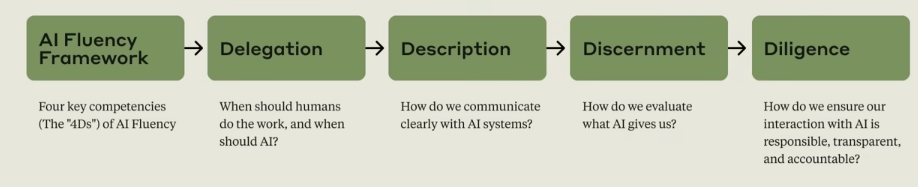

# Course Road Map

## Deep Dives

- What is Generative AI?
- Capabilities and limitations
- Practical prompting techniques

## Learning Outcomes

- A framework for thinking about AI interactions
- The ability to make informed decisions about when and how to engage with AI systems
- Practical skills for more fluent human-AI collaboration
- Confidence in evaluating and taking responsibility for AI output

## Key Takeaways

- This course focuses on human-AI collaboration, not just understanding AI as a technology.
- AI Fluency means engaging with AI systems effectively, efficiently, ethically, and safely.
- The AI Fluency Framework centers on the "4D" competencies of Delegation, Description, Discernment, and Diligence.
- The goal is to develop lasting skills that remain relevant as AI technology evolves.
- Effective AI collaboration requires both practical skills and a fundamental shift in how we think about working with AI.

## Exercises

### Putting Things into Practice

You will need access to a language model (5-10 minutes).

Throughout this course, you will practice what you are learning by working directly with a language model. While our examples feature Claude (Anthropic's AI assistant), you are welcome to work with any language model you prefer. The principles and skills we explore apply across different AI systems.

Getting started is simple and free:

- Claude: Visit [claude.ai](https://claude.ai) to create a free account
- No paid subscriptions are required to complete course activities
- You can also use other AI chatbots if you prefer
- New to Claude? No worries. We will provide clear guidance with each exercise to help you get started

## Reflection

Before moving on, take a moment to consider your own experiences with AI:

- What challenges have you encountered when working with AI to achieve specific outcomes?
- What possibilities for AI collaboration excite you most?
- What do you hope to gain from this course?

## What's Next

In the next lesson, we will explore why AI Fluency matters in today's rapidly evolving technological landscape. We will introduce three key ways people collaborate with AI (Automation, Augmentation, and Agency) and the core competencies of the AI Fluency Framework: the "4Ds" of Delegation, Description, Discernment, and Diligence.

## Feedback on This Course

As you progress through the course, we'd love to hear how you are using concepts from the course in your life, work, or classes, and any feedback you may have. Share your feedback here.

## Acknowledgments and License

Copyright 2025 Rick Dakan, Joseph Feller, and Anthropic.

Released under the CC BY-NC-SA 4.0 license. This course is based on *The AI Fluency Framework* by Dakan and Feller. Supported in part by the Higher Education Authority, Ireland, through the National Forum for the Enhancement of Teaching and Learning.