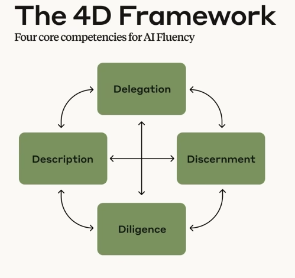

# The AI Fluency Framework

## Why Do We Need AI Fluency?

AI Fluency involves developing practical skills, knowledge, insights, and values that help you interact with AI systems in ways that are effective, efficient, ethical, and safe.

We also introduce three ways people engage with AI:

- Automation: The AI completes specific tasks based on your instructions
- Augmentation: You and AI collaborate as creative thinking and task execution partners
- Agency: You configure AI to work independently on your behalf, establishing its knowledge and behavior patterns rather than just giving it specific tasks

### What Is AI Fluency?

AI Fluency means interacting with AI systems in ways that are **Effective**, **Efficient**, **Ethical**, and **Safe**.

### Three Ways to Interact with AI

- **Automation**: AI does the work for you, following explicit instructions
- **Augmentation**: You and AI work collaboratively together
- **Agency**: AI works independently on your behalf

## The 4D Framework

The four core competencies of AI Fluency are the "4Ds": Delegation, Description, Discernment, and Diligence.

- **Delegation**: Thoughtfully deciding what work to do with AI vs. doing yourself
- **Description**: Communicating clearly with AI systems
- **Discernment**: Evaluating AI outputs and behavior with a critical eye
- **Diligence**: Ensuring you interact with AI responsibly

We explore how these competencies work together across different ways of engaging with AI, and why developing these skills prepares you for whatever AI evolution brings next.

## Key Takeaways

- AI Fluency means engaging with AI in ways that are effective, efficient, ethical, and safe
- There are three primary ways we engage with AI:
	- Automation: AI executes specific tasks based on your instructions
	- Augmentation: You and AI collaborate as creative thinking and task execution partners
	- Agency: You guide AI to work independently on your behalf, shaping its knowledge and behavior rather than specific actions
- The AI Fluency Framework consists of four core competencies (the 4Ds):
	- Delegation: Deciding what work to do with AI vs. yourself
	- Description: Communicating effectively with AI systems
	- Discernment: Evaluating AI outputs critically
	- Diligence: Ensuring responsible AI collaboration
- These competencies apply across all three ways of working with AI
- Developing these competencies prepares you for evolving AI capabilities

## Exercises

### Exercise 1: Apply the 4Ds

**Estimated time:** 5 minutes

Pick one of these collaboration scenarios and consider how you might apply the 4D Framework.

#### Communication Project

You are working with an AI assistant to draft a series of emails for a marketing campaign.

- **Delegation**: What aspects of this project would you handle yourself vs. collaborate on with AI?
- **Description**: How would you communicate your vision for the campaign's tone, purpose, and success criteria to the AI?
- **Discernment**: What criteria would help you evaluate whether the AI-drafted emails meet your needs?
- **Diligence**: What considerations around transparency and responsibility would be important?

#### Research Project

You are using AI to help analyze a large dataset for a research paper.

- **Delegation**: How would you divide the analytical work between yourself and the AI?
- **Description**: What context would the AI need to understand about your research question to do its share of the tasks well?
- **Discernment**: How would you verify the AI's analysis for accuracy?
- **Diligence**: What ethical considerations might arise when publishing AI-assisted research?

#### Creative Project

You are collaborating with AI to develop character concepts for a story.

- **Delegation**: What creative elements would you want to explore through AI collaboration vs. develop independently?
- **Description**: How might you guide the AI to generate characters that fit your story's world?
- **Discernment**: How would you decide which AI-suggested elements to keep, modify, or discard?
- **Diligence**: How would you acknowledge AI's contribution to your creative work?

### Exercise 2: Explore Something You Love

**Estimated time:** 5-10 minutes

Spend 5-10 minutes chatting with Claude about a topic you are passionate about and know well. We will use Claude across exercises for the rest of the course, but you can also do these exercises with another AI. It may also be worthwhile to try the exercises across this course with several AI assistants to get a feel for how they differ.

Instructions:

- Choose a topic you know well and enjoy discussing, such as a hobby, professional interest, favorite book series, etc.
- Have a natural conversation with Claude about this topic, like you would with someone who shares your interest.
- Try to notice moments where:
	- Claude enhances your thinking
	- You need to clarify or correct Claude's understanding
	- Your expertise leads you to evaluate Claude's responses

### Exercise 3: Learn Something New

**Estimated time:** 5-10 minutes

Spend 5-10 minutes asking Claude to teach you about a topic you are unfamiliar with but interested in exploring. See how this experience differs from your conversation about something you love and know well.

Instructions:

- Choose a topic you would like to learn more about
- Engage Claude in a conversation to help you understand the basics of this topic. Do not worry about prompting the "wrong way" or the "right way". Just ask Claude to teach you
- Try to notice moments where Claude:
	- Offers helpful explanations
	- Provides examples that make abstract ideas concrete
	- Responds naturally to your questions as they arise
	- Explains things where you would want to double-check its explanations

## Reflection

Before moving on, take a moment to consider:

- Which of the 4Ds (Delegation, Description, Discernment, Diligence) do you feel most confident in already? Which might need more development?
- Can you recall a recent AI interaction where the framework might have helped?
- What specific skills from the 4D framework would most enhance your work or personal projects?

## What's Next

The next lesson, Deep Dive 1: "What is Generative AI?", is a two-part technical lesson that explains the foundational workings of modern AI, how it differs from previous technologies, and its current capabilities and limitations. This knowledge will provide valuable context for the 4Ds and especially strengthen your Delegation competence.

## Feedback

As you progress through the course, we'd love to hear from you about how you are using concepts from the course in your life, work, or classes, and any feedback you may have. Share your feedback here.

## Acknowledgments and License

Copyright 2025 Rick Dakan, Joseph Feller, and Anthropic. Released under the CC BY-NC-SA 4.0 license. This course is based on *The AI Fluency Framework* by Dakan and Feller.

Supported in part by the Higher Education Authority, Ireland, through the National Forum for the Enhancement of Teaching and Learning.