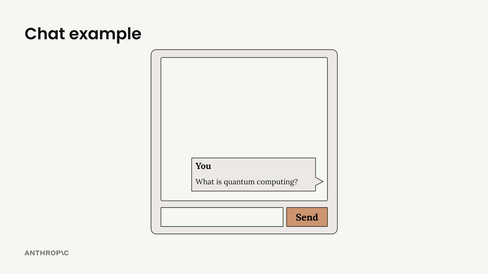
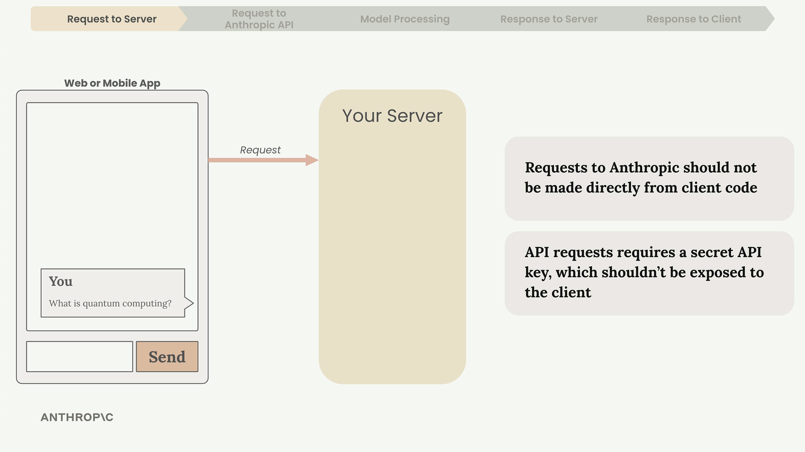
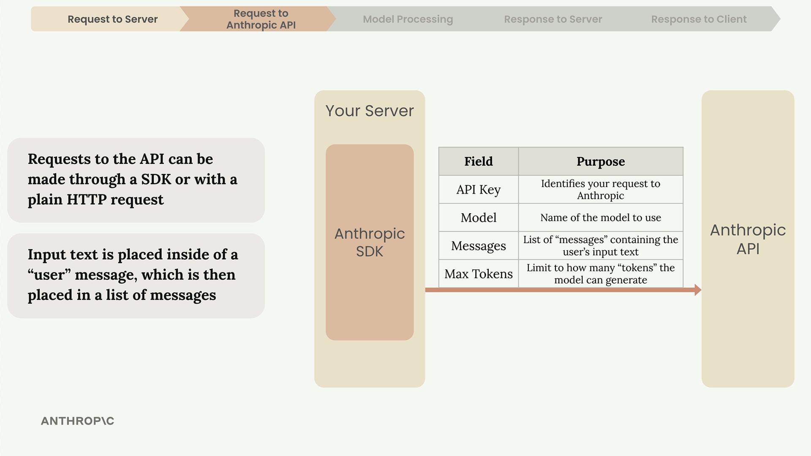
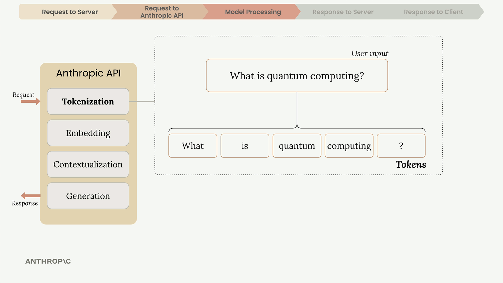
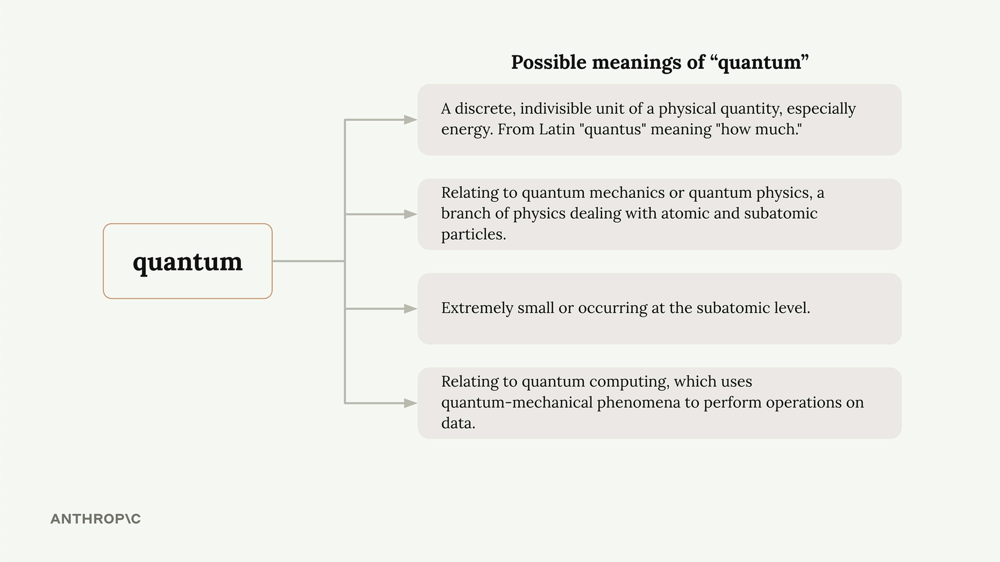
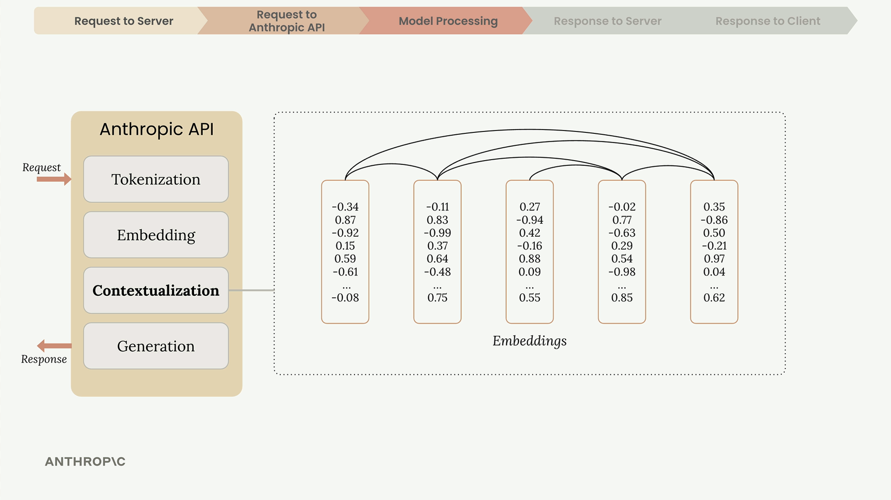
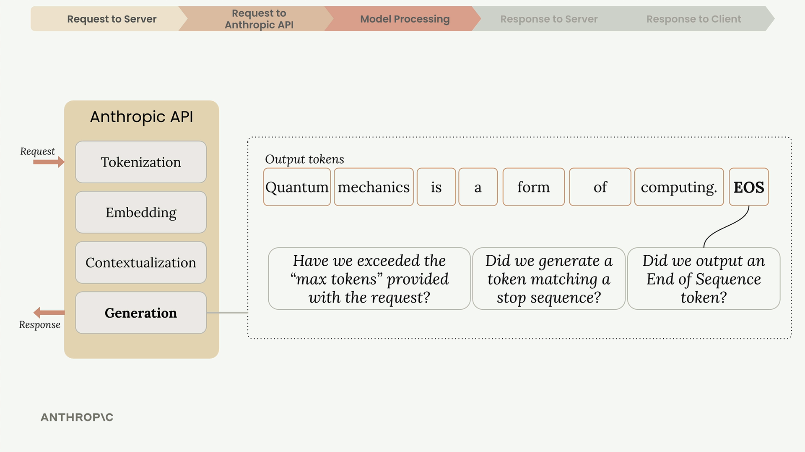
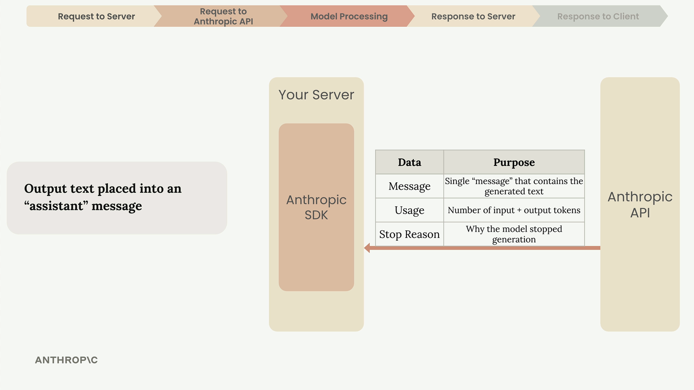
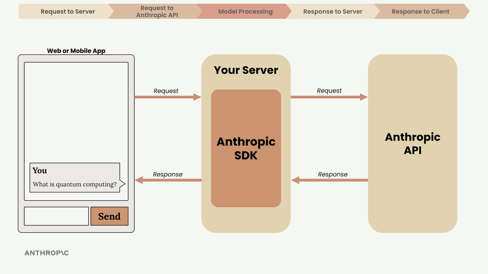

# SS01 · Accessing the API
# When Building Applications with Claude

Understanding the complete request lifecycle helps you make better architectural decisions and debug issues more effectively. Let's walk through what happens from the moment a user clicks **"Send"** in your chat interface to when Claude's response appears on screen.

## The Five-Step Request Flow

Every interaction with Claude follows a predictable pattern with five distinct phases:

1. Request to server
2. Request to Anthropic API
3. Model processing
4. Response to server
5. Response to client

## Why You Need a Server

You should never make requests to the Anthropic API directly from client-side code. Here's why:

1. API requests require a secret API key for authentication.
2. Exposing this key in client code creates a serious security vulnerability.
3. Anyone could extract the key and make unauthorized requests.

Instead, your web or mobile app sends requests to your own server, which then communicates with the Anthropic API using the securely stored key.

## Making API Requests

When your server contacts the Anthropic API, you can use either an official SDK or make plain HTTP requests. Anthropic provides SDKs for:

- Python
- TypeScript
- JavaScript
- Go
- Ruby

Every request must include these essential fields:

1. **API Key** - Identifies your request to Anthropic.
2. **Model** - Name of the model to use (for example, `"claude-3-sonnet"`).
3. **Messages** - List containing the user's input text.
4. **Max Tokens** - Limit for how many tokens Claude can generate.

## Inside Claude's Processing

Once Anthropic receives your request, Claude processes it through four main stages:

1. Tokenization
2. Embedding
3. Contextualization
4. Generation

### Tokenization

Claude first breaks your input text into smaller chunks called **tokens**. These can be whole words, parts of words, spaces, or symbols.

For simplicity, think of each word as one token.

### Embedding

Each token gets converted into an **embedding**: a long list of numbers that represents all possible meanings of that word.

Think of embeddings as numerical definitions that capture semantic relationships.

Words often have multiple meanings. For example, **"quantum"** could refer to:

1. A discrete unit of physical quantity (physics)
2. Quantum mechanics or quantum physics concepts
3. Something extremely small or subatomic
4. Quantum computing applications

### Contextualization

Claude refines each embedding based on surrounding words to determine the most likely meaning in context.

This process adjusts the numerical representations to highlight the appropriate definition.

### Generation

The contextualized embeddings pass through an output layer that calculates probabilities for each possible next word.

Claude does not always pick the highest-probability word. Instead, it uses a combination of probability and controlled randomness to create natural and varied responses.

After selecting each word, Claude adds it to the sequence and repeats the entire process for the next word.

## When Claude Stops Generating

After each token, Claude checks several conditions to decide whether to continue:

1. **Max tokens reached** - Has it hit the limit you specified?
2. **Natural ending** - Did it generate an end-of-sequence token?
3. **Stop sequence** - Did it encounter a predefined stop phrase?

## The API Response

When generation completes, the API sends back a structured response containing:

1. **Message** - The generated text
2. **Usage** - Count of input and output tokens
3. **Stop Reason** - Why generation ended

Your server receives this response and forwards the generated text back to your client application, where it appears in the user interface.

## Key Takeaways

Understanding this flow helps you:

1. Design secure architectures that protect your API keys.
2. Set appropriate token limits for your use case.
3. Handle different stop reasons in your application logic.
4. Debug issues by understanding where they might occur in the pipeline.

Don't worry about memorizing every detail. The goal is to become familiar with the terminology and overall process you'll encounter when working with Claude's API.