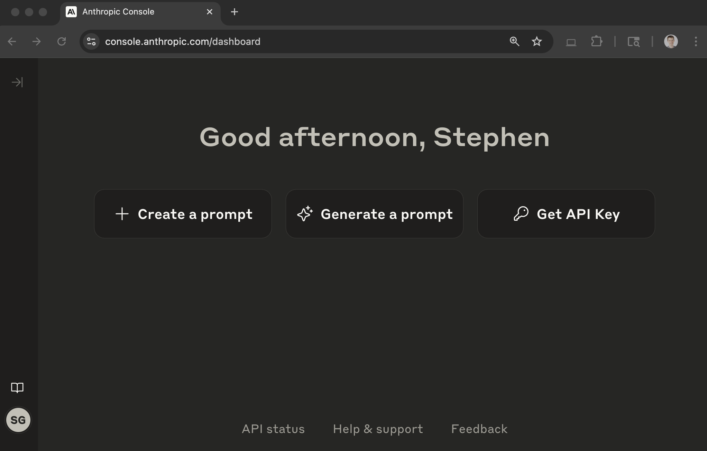
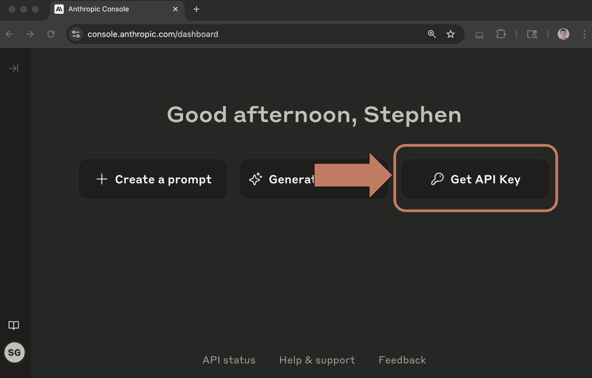
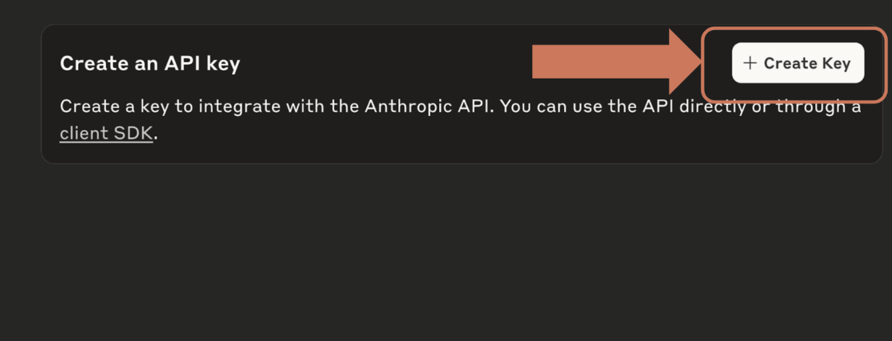

# SS02 · Getting an API Key
# Creating an Anthropic API Key

In the next video, we will be making a request to the Anthropic API. To do so, you will need a secret API key.

This guide will walk you through the process of creating an API key.

## Step One: Navigate to the Anthropic API Console

In your browser, navigate to:

https://console.anthropic.com/

Log in to your Anthropic account.

You'll then see a page like this:

## Step Two: Click the 'Get API Keys' Button

This button can be found towards the top right of the main dashboard page.

## Step Three: Click the 'Create Key' Button

At the top right of the page, find the **'Create Key'** button and click it.

## Step Four: Enter a Workspace and Name for Your Key

Create the key in the workspace **'Default'** and enter a name for your key.

This name is used to help you identify the keys you generate.

Let's use the name:

> Anthropic Course

## Step Five: Copy the Key

Your API key will then be displayed in a pop-up window.

Copy this key and hold onto it. We will use it in the next video.

> **Important:** This key will only be displayed once, so make sure you copy it.

If you accidentally close the window, delete the old key and generate it again.