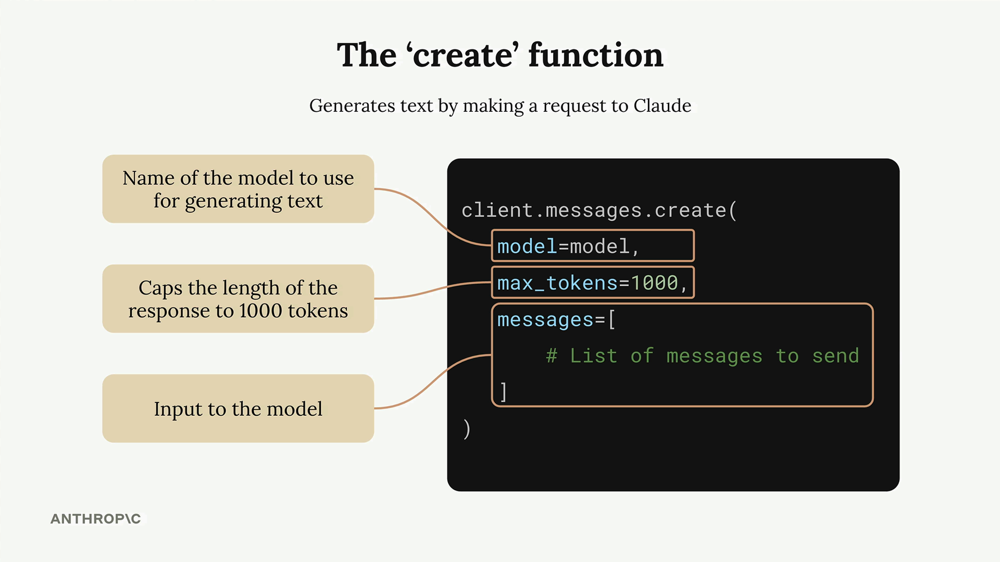
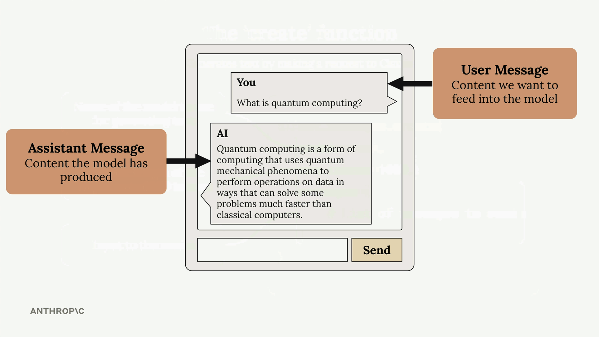

# SS03 · Making a Request
# Making Your First Request to the Anthropic API

[:material-notebook-outline: Open Jupyter Notebook](../../notebooks/01.making_a_request.ipynb){ .md-button .md-button--primary }

Making your first request to the Anthropic API is straightforward once you understand the basic setup and structure. This guide walks through the essential steps to get Claude responding to your prompts using Python.

## Setting Up Your Environment

Before making any API calls, you need to install the required packages and configure your API key securely.

First, install the necessary dependencies in your Jupyter notebook:

```python
%pip install anthropic python-dotenv
```

Next, create a `.env` file in the same directory as your notebook to store your API key securely:

```env
ANTHROPIC_API_KEY="your-api-key-here"
```

This approach keeps your API key out of your code and prevents accidentally committing it to version control.

> Always add `.env` to your `.gitignore` file.

Load the environment variables and create your API client:

```python
from dotenv import load_dotenv

load_dotenv()

from anthropic import Anthropic

client = Anthropic()

model = "claude-sonnet-4-0"
```

## The Create Function

The core of making API requests is the `client.messages.create()` function.



This function requires three key parameters:

1. **model** - The name of the Claude model you want to use.
2. **max_tokens** - A safety limit on response length (not a target).
3. **messages** - The conversation history you're sending to Claude.

The `max_tokens` parameter acts as a safety mechanism.

If you set it to `1000`, Claude will stop generating after 1000 tokens even if it has more to say. Claude does not try to reach this limit. It simply generates what it believes is an appropriate response and stops naturally unless it reaches the maximum.

## Understanding Messages

Messages represent the conversation between you and Claude, similar to a chat application.



There are two types of messages:

1. **User messages** - Content you want to send to Claude (written by humans).
2. **Assistant messages** - Responses that Claude has generated.

Each message is a dictionary with:

- **role**: Either `"user"` or `"assistant"`
- **content**: The actual text of the message

## Making Your First Request

Here's a complete example of making a request to Claude:

```python
message = client.messages.create(
    model=model,
    max_tokens=1000,
    messages=[
        {
            "role": "user",
            "content": "What is quantum computing? Answer in one sentence"
        }
    ]
)
```

When you run this code, Claude will process your request and return a response object containing the generated text along with metadata about the request.

## Extracting the Response

The response object contains a lot of information, but you will usually just want the generated text.

Access it using:

```python
message.content[0].text
```

This gives you clean, readable output such as:

> "Quantum computing is a type of computation that leverages quantum mechanics principles like superposition and entanglement to process information using quantum bits (qubits), potentially solving certain complex problems exponentially faster than classical computers."

## Summary of the Workflow

1. Install the Anthropic SDK and `python-dotenv`.
2. Store your API key in a `.env` file.
3. Load environment variables.
4. Create an Anthropic client.
5. Call `client.messages.create()`.
6. Extract the generated text from the response.

With these basics in place, you can start experimenting with different prompts and building more complex interactions with Claude.

---

## Getting Started Checklist

- Install the Anthropic Python SDK and `python-dotenv`
- Store and load your API key securely using `.env`
- Create an Anthropic client
- Make a request and examine the response