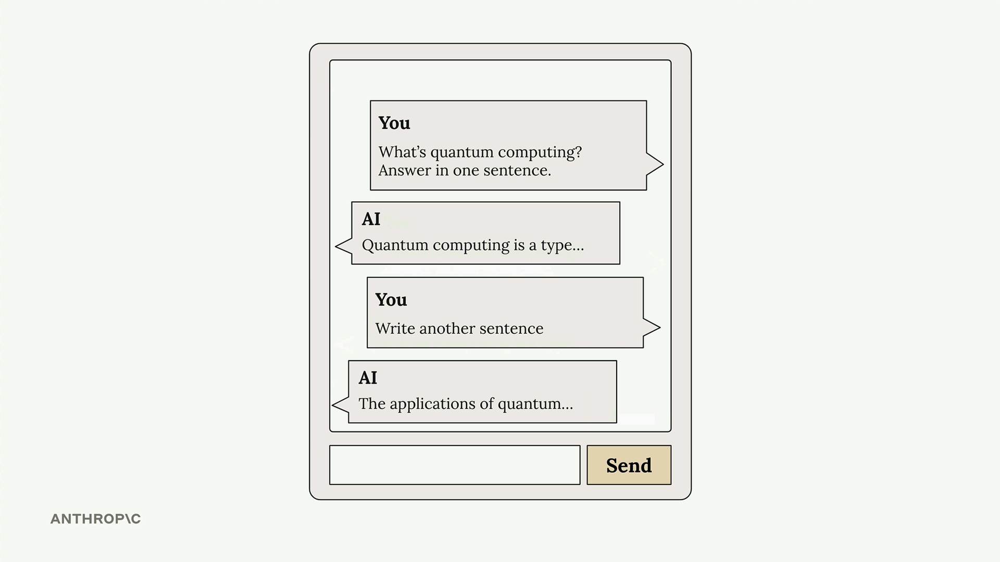
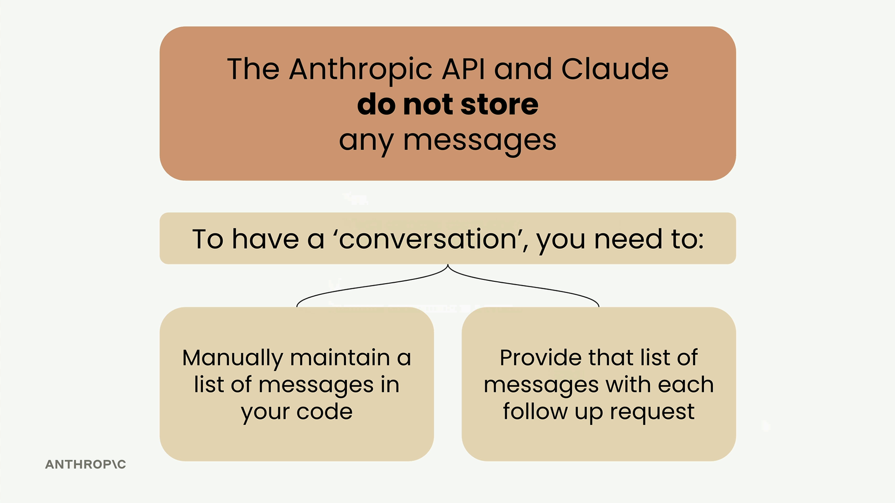
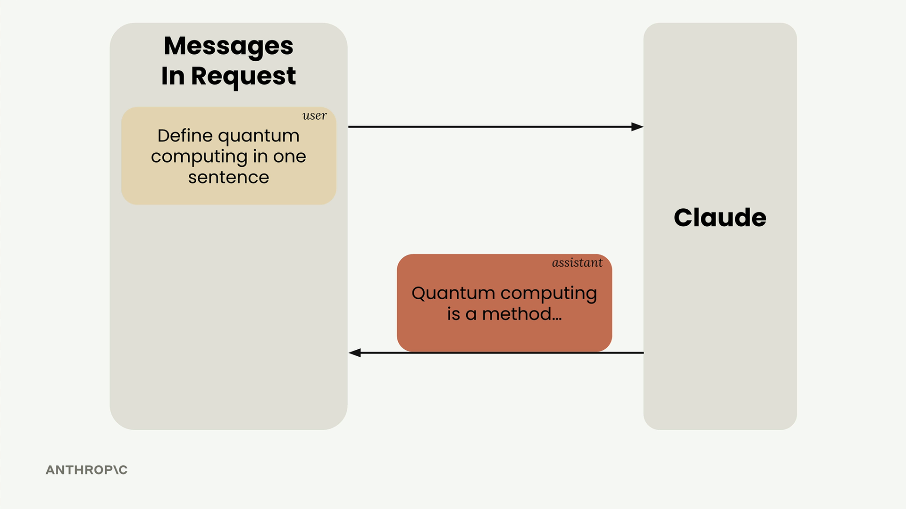
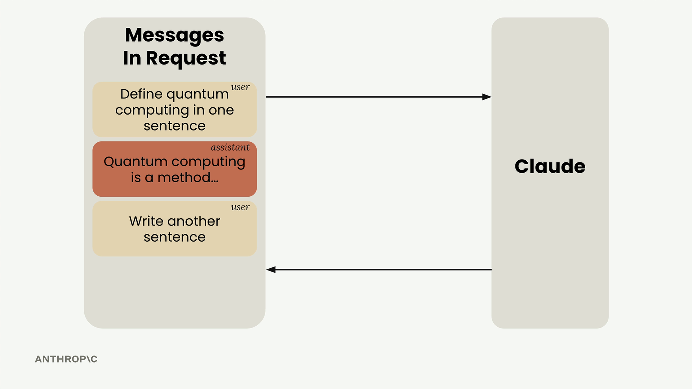

# SS04 · Multi-Turn Conversations

[:material-notebook-outline: Open Jupyter Notebook](../../notebooks/01.making_a_request.ipynb){ .md-button .md-button--primary }


When working with the Anthropic API and Claude, there's a crucial concept you need to understand:



**Claude doesn't store any of your conversation history.**

Each request you make is completely independent, with no memory of previous exchanges.

This means if you want to have a multi-turn conversation where Claude remembers context from earlier messages, you need to handle the conversation state yourself.

## The Problem with Stateless Conversations

Let's say you ask Claude:

> What is quantum computing?

and get a good response.

Then you follow up with:

> Write another sentence.



Claude has no idea what you're referring to. It will write a sentence about something completely random because it has no memory of the quantum computing discussion.

## How Multi-Turn Conversations Work

To maintain conversation context, you need to do two things:

1. Manually maintain a list of all messages in your code.
2. Send the complete message history with every request.



Here's the flow that actually works:

1. Send your initial user message to Claude.
2. Take Claude's response and add it to your message list as an assistant message.
3. Add your follow-up question as another user message.
4. Send the entire conversation history to Claude.



## Building Helper Functions

To make conversation management easier, you can create three helper functions:

```python
def add_user_message(messages, text):
    user_message = {"role": "user", "content": text}
    messages.append(user_message)

def add_assistant_message(messages, text):
    assistant_message = {"role": "assistant", "content": text}
    messages.append(assistant_message)

def chat(messages):
    message = client.messages.create(
        model=model,
        max_tokens=1000,
        messages=messages,
    )

    return message.content[0].text