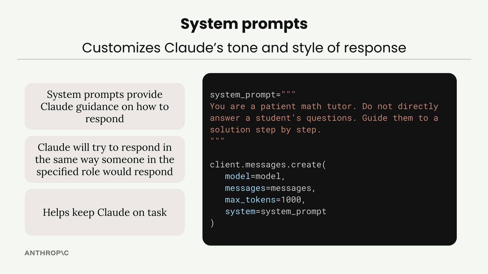

# SS06 · System Prompts

[:material-notebook-outline: Open Jupyter Notebook](../../notebooks/03.system_prompts.ipynb){ .md-button .md-button--primary }


System prompts are a powerful way to customize how Claude responds to user input. Instead of getting generic answers, you can shape Claude's tone, style, and approach to match your specific use case.


## Why System Prompts Matter

Consider building a math tutor chatbot.

When a student asks:

> How do I solve 5x + 2 = 3 for x?

you want Claude to act like a real tutor, not just provide the answer immediately.

A good math tutor should:

1. Initially give hints rather than complete solutions.
2. Patiently walk students through problems step by step.
3. Show solutions for similar problems as examples.

You definitely don't want Claude to:

1. Immediately give direct answers.
2. Tell students to just use a calculator.

## How System Prompts Work



System prompts provide Claude with guidance on how to respond.

You define them as plain strings and pass them into the `create()` function call.

Key benefits include:

1. System prompts provide Claude guidance on how to respond.
2. Claude will try to respond in the same way someone in the specified role would respond.
3. Helps keep Claude on task.

Here's the basic structure:

```python
system_prompt = """
You are a patient math tutor.
Do not directly answer a student's questions.
Guide them to a solution step by step.
"""

client.messages.create(
    model=model,
    messages=messages,
    max_tokens=1000,
    system=system_prompt
)
```

## Seeing the Difference

Without a system prompt, Claude typically gives a complete step-by-step solution immediately.

While this may be helpful, it doesn't encourage the student to think through the problem independently.

With the math tutor system prompt, Claude's behavior changes dramatically. Instead of providing the entire solution, Claude asks guiding questions such as:

> What do you think would be a good first step to isolate x? Consider what operation we might need to perform on both sides to start moving terms around.

## Building a Flexible Chat Function

Rather than hard-coding system prompts, you can make your chat function more reusable by accepting system prompts as parameters.

```python
def chat(messages, system=None):
    params = {
        "model": model,
        "max_tokens": 1000,
        "messages": messages,
    }

    if system:
        params["system"] = system

    message = client.messages.create(**params)

    return message.content[0].text
```

This approach handles an important detail:

Claude's API does not accept `system=None`, so you should only include the `system` parameter when a system prompt is actually provided.

## Using the Flexible Chat Function

Without a system prompt:

```python
answer = chat(messages)
```

With a system prompt:

```python
system = """
You are a patient math tutor.
Do not directly answer a student's questions.
Guide them to a solution step by step.
"""

answer = chat(messages, system=system)
```

## Summary

System prompts are essential for creating AI applications that behave consistently and appropriately for their intended purpose.

They transform generic AI responses into specialized, role-appropriate interactions by controlling the model's tone, style, behavior, and objectives.