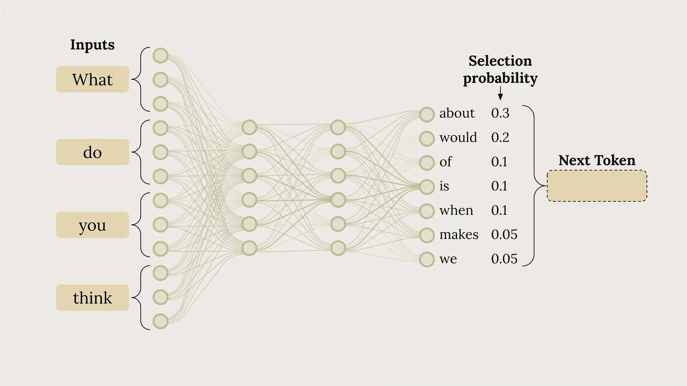
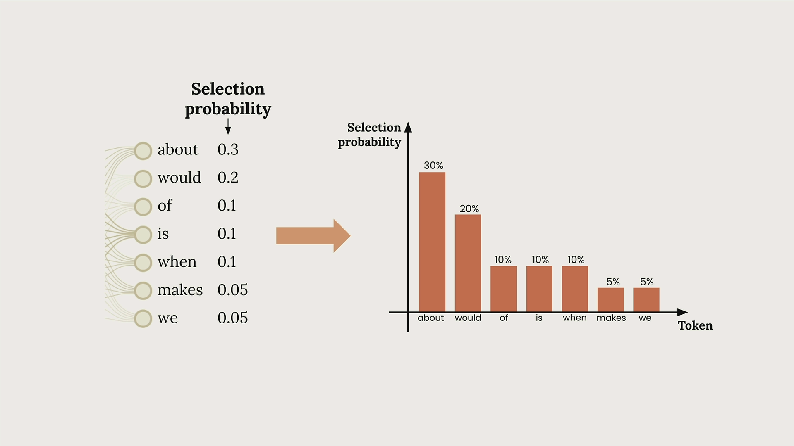
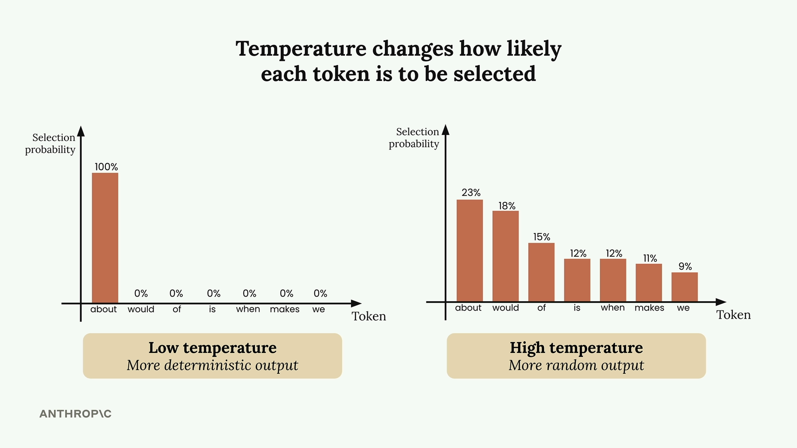
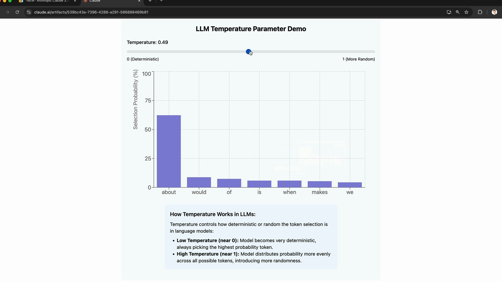
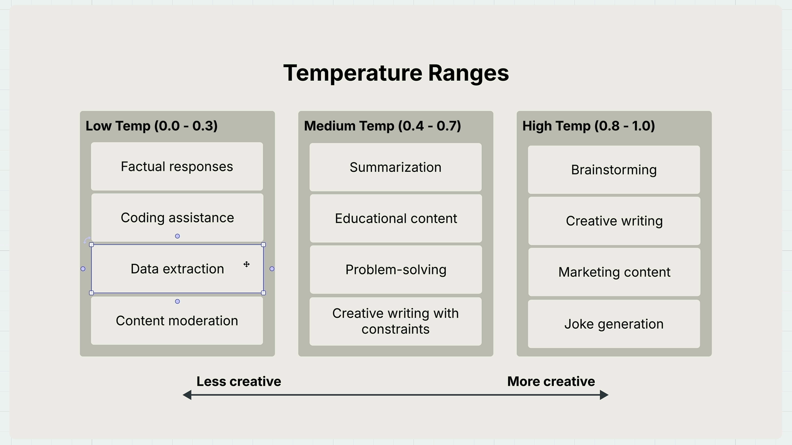

# SS08 · Temperature

[:material-notebook-outline: Open Jupyter Notebook](../../notebooks/05.temperature.ipynb){ .md-button .md-button--primary }

# Temperature

Temperature is a powerful parameter that controls how predictable or creative Claude's responses will be. Understanding how to use it effectively can dramatically improve your AI applications.

## How Claude Generates Text

Before diving into temperature, it helps to understand Claude's text generation process. When you send Claude a prompt like **"What do you think?"**, it goes through three key steps:

1. **Tokenization** - Breaking your input into smaller chunks
2. **Prediction** - Calculating probabilities for possible next words
3. **Sampling** - Choosing a token based on those probabilities



In this example, Claude might assign a 30% probability to `"about"`, 20% to `"would"`, 10% to `"of"`, and so on. The model then selects one token and repeats this entire process to build complete sentences.



## What Temperature Does

Temperature is a decimal value between 0 and 1 that directly influences these selection probabilities. It's like adjusting the "creativity dial" on Claude's responses.



At low temperatures (near 0), Claude becomes very deterministic and almost always picks the highest-probability token. At high temperatures (near 1), Claude distributes probability more evenly across options, leading to more varied and creative outputs.

## Interactive Temperature Demo

You can see temperature in action with Claude's interactive demo. Watch how the probability distribution changes as you adjust the temperature slider:



- At temperature **0.0**, `"about"` gets 100% probability, making the output completely deterministic.
- At temperature **1.0**, probabilities spread more evenly across all possible tokens, introducing randomness and creativity.

## Choosing the Right Temperature

Different tasks call for different temperature ranges.



### Low Temperature (0.0 - 0.3)

- Factual responses
- Coding assistance
- Data extraction
- Content moderation

### Medium Temperature (0.4 - 0.7)

- Summarization
- Educational content
- Problem-solving
- Creative writing with constraints

### High Temperature (0.8 - 1.0)

- Brainstorming
- Creative writing
- Marketing content
- Joke generation

## Implementing Temperature in Code

Adding temperature support to your chat function is straightforward. Here's how to modify your existing function:

```python
def chat(messages, system=None, temperature=None):
    params = {
        "model": model,
        "max_tokens": 1000,
        "messages": messages
    }

    if system:
        params["system"] = system

    if temperature is not None:
        params["temperature"] = temperature

    message = client.messages.create(**params)
    return message.content[0].text
```

Why `temperature is not None`?

It allows `0.0` to be passed correctly. If you use `if temperature:`, then `0.0` is treated as false and won't be sent.

## Testing Temperature Effects

To see temperature in action, run the same prompt with different settings:

```python
# No temperature argument (model default)
answer = chat(messages)

# Low temperature (more predictable)
answer = chat(messages, temperature=0.0)

# High temperature (more creative)
answer = chat(messages, temperature=1.0)
```

At `0.0`, outputs are usually more deterministic and repeatable.
At `1.0`, outputs typically show more variation in tone, wording, and ideas.

## Key Takeaways

Remember that temperature doesn't guarantee different outputs. It simply changes the probability of getting them.

Even at high temperatures, Claude might occasionally produce similar responses. The key is matching your temperature choice to your specific use case:

1. Need consistent, factual responses? Use a low temperature.
2. Want creative brainstorming? Increase the temperature.
3. Need something in between? Medium temperatures work well for most general tasks.

Temperature is one of the most practical parameters you can adjust to fine-tune Claude's behavior for your specific needs.

## Notebook Walkthrough

Open the notebook and run cells from top to bottom.

In the final demo section, the same prompt is executed in three modes:
1. Without temperature (model default)
2. With low temperature (`0.0`)
3. With high temperature (`1.0`)

When reviewing the outputs, compare:
1. Repeatability of wording
2. Creativity and variation in ideas
3. How strongly each result follows your expected style

Tip: Re-run only the final comparison code cell 2-3 times to clearly see variation patterns.