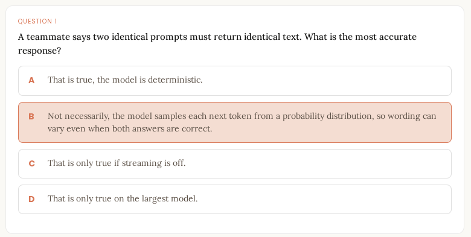
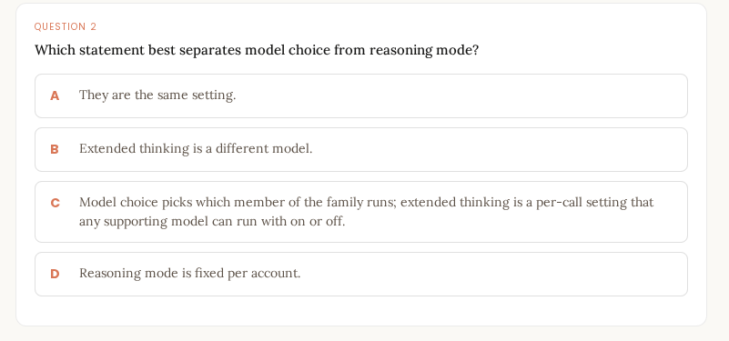
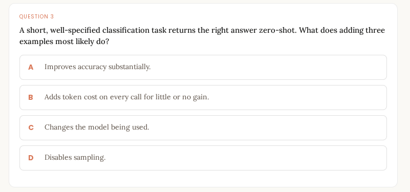
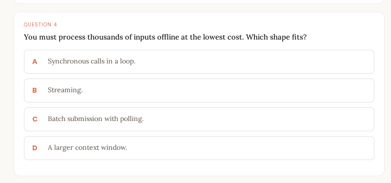
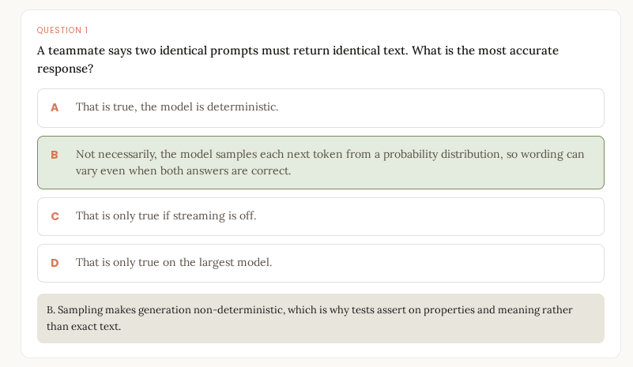
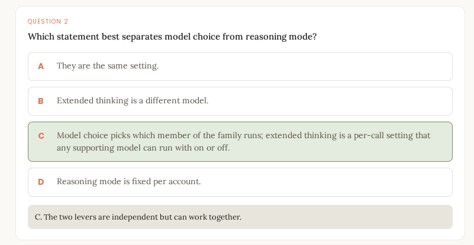
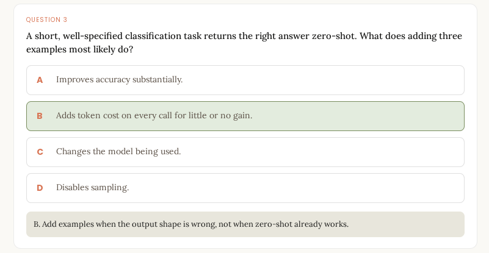
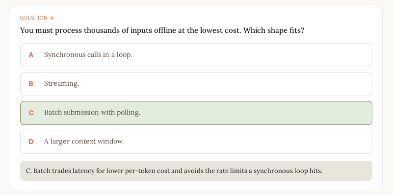

# Quiz

# Excersice 
# Scenario 1

## Question
Consider a classification task run at temperature 0 versus the same task run at a high temperature. Predict how the outputs differ across repeated runs.

### Options
**A.** At a low temperature, the model concentrates probability on the most likely tokens, so repeated runs return the same label far more consistently, though never with guaranteed determinism, even at temperature 0. At a high temperature, the distribution spreads out, so wording and even the chosen label can vary. For a classifier you want the low-temperature, repeatable behavior.

**B.** Both configurations return identical output every run, because temperature only affects response length, not which tokens are chosen.

**C.** The high-temperature run is more accurate, because spreading the distribution lets the model consider more of the correct answers.

**D.** Temperature has no effect on a classification task, because classification always returns a fixed label regardless of sampling.

## Correct Answer
✅ **A**

## Reason
Temperature controls how much randomness is used when selecting tokens.

- **Low temperature (especially temperature = 0)** makes the model strongly favor the highest-probability output, resulting in more consistent classification results across runs.
- **High temperature** increases randomness, allowing less likely tokens to be selected, which can lead to different wording or even different classifications across runs.
- Classification tasks generally benefit from **low temperature** because consistency and repeatability are important.

### Why the others are incorrect
- **B:** Temperature affects token selection, not just response length.
- **C:** Higher temperature does not inherently improve accuracy; it primarily increases variability.
- **D:** Classification outputs can still vary when sampling is involved, especially at higher temperatures.

---

# Scenario 2

## Question
Consider a task that keeps returning output in the wrong structure under a zero-shot prompt. Predict what changes if you switch to multi-shot.

### Options
**A.** Switching to multi-shot retrains the model on the new structure, so the change is permanent across every future call once the examples are sent.

**B.** Adding two or three correct input-output examples shows the model the exact structure to match, which usually fixes a structure problem that more instruction text did not. The cost is extra tokens on every call, so add the fewest examples that make the output reliable.

**C.** Multi-shot will not help a structure problem; only raising the temperature changes the shape of the output.

**D.** Multi-shot lowers the token cost per call, because examples let the model produce shorter responses.

## Correct Answer
✅ **B**

## Reason
Multi-shot prompting provides examples that demonstrate exactly how the output should be formatted.

- When a model struggles with structure under zero-shot prompting, adding a few examples often significantly improves compliance with the desired format.
- The examples act as patterns for the model to imitate.
- However, every example consumes additional prompt tokens, increasing the cost of each request.

### Why the others are incorrect
- **A:** Multi-shot prompting does **not retrain** the model. The effect exists only for that specific prompt.
- **C:** Multi-shot prompting is specifically one of the most effective methods for correcting output structure.
- **D:** Multi-shot increases prompt size and therefore typically increases token usage rather than reducing it.

---

# Scenario 3

## Question
Consider a pipeline that must process 50,000 documents overnight with no user waiting. Predict which request shape fits and why.

### Options
**A.** A synchronous loop fits best, because calling the API once per document is the simplest pattern and avoids the overhead of submitting a batch.

**B.** Streaming fits best, because sending the response in pieces lets the pipeline start processing each document sooner.

**C.** The batch pattern fits: submit the requests in a batch and poll for completion, accepting longer latency for a lower per-token cost. A synchronous loop would hit rate limits and tie up the application, and streaming buys nothing because no user is watching.

**D.** A larger context window fits best, because fitting all 50,000 documents into one request avoids making repeated calls.

## Correct Answer
✅ **C**

## Reason
Batch processing is designed for large-scale, non-interactive workloads.

- The pipeline has **50,000 documents** and **no human waiting for immediate results**.
- Batch jobs allow requests to be submitted together and processed asynchronously.
- Higher latency is acceptable because the results are needed later, not instantly.
- Batch processing is generally more efficient and scalable for large workloads.

### Why the others are incorrect
- **A:** A synchronous loop can be slow, inefficient, and may encounter rate-limit issues at large scale.
- **B:** Streaming is most useful when a user benefits from seeing partial results immediately. Here, no user is waiting.
- **D:** Context windows have limits; placing 50,000 documents into a single request is impractical and inefficient.

---

# Summary

| Scenario | Correct Answer | Key Concept |
|-----------|---------------|-------------|
| Scenario 1 | ✅ A | Low temperature improves consistency; high temperature increases randomness |
| Scenario 2 | ✅ B | Multi-shot examples improve output structure without retraining |
| Scenario 3 | ✅ C | Batch processing is best for large, non-interactive workloads |

# Scenario 4

## Question
Consider a long multi-turn agent session whose context window keeps filling. Predict the symptoms and name the budget at fault.

### Options

**A.** The model silently drops the oldest turns to make room, so the session continues but quietly loses early context without any error.

**B.** The context window is a fixed token budget; as history and tool results accumulate it fills. An input that is already oversized is rejected with an error before generation, while a request that fits on input but reaches the ceiling mid-generation comes back with truncated output and a `model_context_window_exceeded` stop reason. The symptom is a session that ran fine in testing failing once inputs grow, which is why the application must trim or summarize history.

**C.** The symptom is slower sampling, and the budget at fault is the temperature setting, which must be lowered as the session grows.

**D.** There is no fixed budget; the window expands automatically to hold whatever history accumulates, so a long session never fails for this reason.

## Correct Answer
✅ **B**

## Reason

A model's **context window is a fixed token budget** that includes:

- System instructions
- User messages
- Assistant responses
- Tool outputs
- Retrieved documents
- Generated output tokens

As a conversation grows, the total token count increases. Once the context window limit is reached, problems occur:

1. **Oversized requests** may be rejected before generation begins.
2. **Requests that initially fit** may run out of available context during generation, causing truncated output.
3. Long-running agent sessions often work during testing with small inputs but fail later when conversation history and tool results accumulate.

To avoid this problem, applications commonly:

- Trim old messages
- Summarize earlier conversation history
- Store long-term memory outside the context window
- Limit tool output size

### Why the others are incorrect

- **A:** Models do not universally and automatically drop old context. This behavior depends on the application, not the model itself.
- **C:** Temperature controls randomness and creativity, not context-window capacity.
- **D:** Context windows are finite and do not automatically expand without limit.

---

# Summary So Far

| Scenario | Correct Answer | Key Concept |
|-----------|---------------|-------------|
| Scenario 1 | ✅ A | Low temperature increases consistency; high temperature increases randomness |
| Scenario 2 | ✅ B | Multi-shot examples improve output structure without retraining |
| Scenario 3 | ✅ C | Batch processing is best for large-scale, non-interactive workloads |
| Scenario 4 | ✅ B | Context windows have fixed token limits that require trimming or summarization |

# Recap
# Recap: Five Takeaways

## 1. Tokens Are the Unit of Input, Output, and Cost

Think and budget in **tokens** rather than words.

Tokens are the unit that:

- The API measures and bills
- The model processes as input
- The model generates as output
- The context window counts

When estimating costs or determining whether content will fit into a request, think in tokens, not characters or words.

---

## 2. The Context Window Is a Fixed Token Budget

The **context window** is a fixed-size token budget that contains the entire request at once, including:

- System prompts
- Conversation history
- Documents
- Tool definitions
- Tool results
- Model output

Two important edge cases exist:

- If the input exceeds the context window before generation starts, the request fails with a validation error.
- If generation reaches the limit after starting, the model returns a partial response and stops with a `model_context_window_exceeded` stop reason.

Because of this, managing conversation history through trimming or summarization is the responsibility of the application.

---

## 3. Sampling Makes Generation Non-Deterministic

Model outputs are produced through **sampling**, which means identical inputs do not guarantee identical outputs.

As a result:

- The same prompt can produce different wording across runs.
- Multiple outputs may all be correct.
- Exact-text assertions are unreliable for testing.

Instead of testing for exact responses, evaluate whether required properties, structure, or meanings are present.

This is why **evaluations (evals)** are a foundational tool for measuring quality and correctness.

---

## 4. Model Choice and Reasoning Mode Are Separate, Composable Levers

Two independent decisions affect model behavior:

### Model Choice

Selects the Claude model tier:

- Haiku
- Sonnet
- Opus
- Fable

### Reasoning Mode

Controls how much thinking the model performs before responding.

A practical strategy is:

1. Start with the simplest prompt.
2. Use the smallest model that meets quality requirements.
3. Add examples only when needed.
4. Increase reasoning effort only when evaluations show it adds value.
5. Upgrade models only when evaluations indicate higher capability is necessary.

---

## 5. Developers Reach Claude Through a REST API, Usually via an SDK

Claude is fundamentally accessed through an HTTP REST API.

Most developers use SDKs because they simplify:

- Authentication
- Request construction
- Response parsing
- Retry handling

Depending on workload requirements, different interaction patterns are available:

- **Synchronous**: Wait for the complete response.
- **Streaming**: Receive output as it is generated.
- **Async/Await**: Support concurrent, non-blocking requests.
- **Message Batches API**: Process large offline workloads at lower cost.

Choose the interaction pattern based on whether:

- A user is actively waiting for a response.
- The workload is real-time or offline.
- Cost or latency is the primary concern.

---

## What Comes Next

**Module 2** builds on these foundations and applies them to practical development topics, including:

- Prompt engineering and prompt structure
- Tool schemas and tool use
- Streaming responses
- Context engineering
- Agent design and construction

With these concepts in place, you now share the core vocabulary used throughout the Developer course:

- Tokens
- Context windows
- Sampling
- Non-determinism
- Model tiers
- Reasoning modes
- Prompting strategies
- REST APIs
- SDKs
- Streaming and asynchronous workflows

These foundations provide the mental model needed to effectively build with Claude in the modules that follow.

---

## Sources

- Claude 101 (Skilljar)
- Building with the Claude API (Skilljar)
- AI Fluency: Framework & Foundations (Skilljar)
- https://platform.claude.com/docs

> Verify current model capabilities, API behavior, parameters, and product specifics against the latest Claude documentation at implementation time.