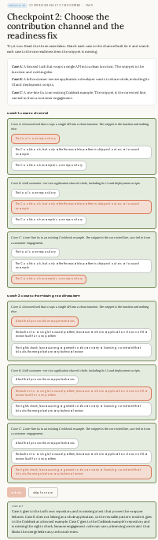

# Contributing Back

## Teaching
# Moving an asset from private reuse into shared infrastructure

A maintainer accepts an asset when it is already packaged for reuse.

You have already done most of the work that makes an asset shareable. When you packaged it for your own team to reuse, you pulled out the parameters, wrote down the assumptions, and bundled the eval. The parameters show the asset can be configured rather than rewritten. The documented assumptions tell the maintainer what environment the asset expects. The bundled eval gives them a way to confirm it still works. An asset packaged for internal reuse is already close to what a maintainer needs to accept it.

The contribution channel is designed to receive that packaged asset. It carries the version, the installation steps, and the components as a single unit, so a team that never spoke to you can install it and get the same working setup.

## Match the contribution to the channel built for it

Contributing back means moving an asset from private reuse to shared infrastructure through a documented channel. Each channel is built for a specific kind of contribution.

The Claude Cookbook is a GitHub repository of focused reference implementations. It is designed for self-contained single- or multi-pattern implementations demonstrated clearly and working end to end. Open-source MCP servers and tools each live in their own repository with their own contribution conventions.

Sending a full multi-component application to the Cookbook is a mismatch. The repository is set up to review one focused pattern rather than an entire application, so a submission that large does not fit what reviewers are looking for and will stall.

The first step is matching the contribution to the channel built for it. Putting a full application where a focused example belongs is one of the most common reasons a contribution never gets reviewed.

## What makes verifying a contribution possible

A maintainer accepts a contribution they can verify. The bar is set by what they need to check, not by how clever the code is.

Four things make that verification possible:

1. The code does one thing. A sprawling contribution forces a reviewer to reconstruct your intent before evaluating it.
2. An example shows it running. A reviewer should not have to build a harness to see the behavior.
3. A test proves it works. A test lets a maintainer verify the result without reproducing the reasoning themselves.
4. A short statement names the assumptions. Otherwise, the first failure becomes the maintainer's problem.

## Rights and attribution come before technical review

Licensing and attribution decide whether a contribution can be accepted at all, which is why they come before the technical review.

Code carried in from a customer engagement may have constraints on where it can go. Confirming you have the right to contribute it, and attributing anything you built on, is a gate the contribution must pass first. Skipping this is what turns a contribution into a problem the legal team must unwind later.

The example worked here is the customer service agent case. A reusable conversation-handling pattern, built during an engagement, gets stripped of customer specifics and prepared as a general example for the Cookbook.

The contribution-back motion is shared across all three roles in this curriculum. Your job as the Developer is technical readiness: the focused code, the example, the test, the assumptions, and the rights check. 

## The contribution-readiness reference

| Channel | What a maintainer checks | Licensing and attribution | The example and test bar to clear |
|----------|-------------------------|---------------------------|-----------------------------------|
| Cookbook for a focused example, or the tool or server's own repository for a tool or fix. | That the code does one thing and that they can read it in full. | Confirm that you have the right to contribute code from an engagement, with prior work attributed. | A runnable example plus a test that proves the behavior, not just a description of it. |

### Handles well

A packaged asset needs only the example, test, and rights check to become shared infrastructure others build on.

### Adds cost or complexity

Clearing the maintainer bar and the licensing gate is real work on top of making the code run for you.

### Use a different approach

When code carries an engagement licensing constraint you cannot clear, do not contribute it; escalate to the owner instead.

## Watch Out
# The pull request a maintainer could not verify

## Setup

You opened the contribution with the exact code that solved your problem. This was the natural choice because it worked in your case and it was accessible. It worked for you, but that is precisely why it was missing everything a stranger needs to trust it.

This is an exchange from an internal channel so you can hear how a maintainer explains the silence on a pull request.

## The exchange

**Developer:** My PR has been open three weeks with no review. The code works, I use it every day.

**Maintainer:** It probably works for you. The problem is I can't tell. There is no test I can run, no example that proves the behavior, and nothing saying what it assumes about the environment.

**Developer:** So, you want me to add a test and an example?

**Maintainer:** Yes. A contribution a reviewer cannot verify sits at the back of the queue until someone has time to reconstruct what it does. A focused PR with a test and an example gets reviewed fast because there is nothing left for me to reverse-engineer.

## Why it broke

The code was correct. The contribution stalled because the maintainer could not verify it without reconstructing the developer's work.

That gap is easy to overlook because the author already has the missing context. The example, the test, and the assumptions statement all seem obvious to the person who created the code. To the maintainer, however, they are not, and a reviewer who must reconstruct intent will always do it last.

## What to Watch Out for

A pull request stalls on what the reviewer cannot verify.

Before opening a contribution, add:

- The example that shows it running.
- The test that proves the behavior.
- The short statement naming what it assumes.

Those three features are what move a contribution from the back of the queue to a fast review, because they leave the maintainer nothing to reverse-engineer.

## Checkpoint
# Checkpoint 2: Choose the Contribution Channel and the Readiness Fix

## Scenario

Try to determine the contribution channel and readiness fix for each case. Match each case to the appropriate contribution channel and readiness fix.

### Cases

**Case A:** A financial lead builds and owns a single API used in a shared line-of-business function. The output is the function and enabling others.

**Case B:** A field customer-service application shard includes, including its UI and deployment scripts.

**Case C:** A user-flow fix for an existing Copilot-like example. The output is the user experience flow; user intent is not a standalone component.

---

# Match 1: Contribution Channel

### Case A
**Correct Answer:**  
✅ **The item is a line-of-business capability**

**Technical Reasoning:**
- The deliverable is a business function exposed through an API.
- The value comes from enabling a business process rather than producing a reusable technical platform component.
- Consumers use the functionality to accomplish business outcomes.
- Therefore it aligns with a **line-of-business capability** contribution channel.

---

### Case B
**Correct Answer:**  
✅ **The item is a workload**

**Technical Reasoning:**
- A workload contains multiple solution elements working together.
- The case explicitly includes application code, UI assets, deployment artifacts, and operational concerns.
- This is larger than a single reusable component and represents an end-to-end deployable solution.
- Therefore the contribution channel is **workload**.

---

### Case C
**Correct Answer:**  
✅ **The item is a user experience**

**Technical Reasoning:**
- The contribution focuses on interaction flow and user intent.
- It is not a reusable platform service, API, library, or deployable workload.
- The primary output is user experience design and behavior.
- Therefore the correct contribution channel is **user experience (UX)**.

---

# Match 2: Readiness Fix

### Case A
**Correct Answer:**  
✅ **All of the above**

**Technical Reasoning:**
A line-of-business capability typically requires:
- Clear ownership and operational support.
- Documentation and discoverability.
- Appropriate testing and validation.
- Adoption guidance for consumers.

Since all listed readiness improvements strengthen the capability, **"All of the above"** is the correct readiness fix.

---

### Case B
**Correct Answer:**  
✅ **Refactor into a single logical ownership boundary because no one else has an approval role over deployments**

**Technical Reasoning:**
- A workload should have a clearly defined ownership boundary.
- Deployment accountability must be unambiguous.
- Multiple unmanaged approval paths increase operational risk and slow release processes.
- Refactoring into a single logical ownership boundary improves governance, deployment control, and supportability.

---

### Case C
**Correct Answer:**  
✅ **The right fix already exists; focus on measuring engagement and effectiveness by learning measurable user behavior rather than reorganizing technical assets**

**Technical Reasoning:**
- User experiences are validated through user outcomes, engagement metrics, usability data, and behavioral signals.
- Reorganizing technical ownership does not improve the UX by itself.
- The correct next step is measurement and optimization based on user behavior.
- Therefore the readiness effort should focus on learning and validating user outcomes.

---

# Summary

| Case | Contribution Channel | Readiness Fix |
|--------|--------------------|---------------|
| A | Line-of-business capability | All of the above |
| B | Workload | Refactor into a single logical ownership boundary because no one else has an approval role over deployments |
| C | User experience | Measure engagement and effectiveness through observable user behavior and outcomes |

# Why These Answers Are Correct

- **Capability** contributions deliver business functionality that others consume.
- **Workloads** are complete deployable solutions comprising multiple assets and operational concerns.
- **User experiences** focus on user journeys, interaction patterns, and outcome validation.

The readiness fixes align with the primary risk for each channel:
- **Capability:** broaden adoption and operational readiness.
- **Workload:** establish clear ownership and deployment governance.
- **User Experience:** validate success through user behavior and measurable outcomes.

