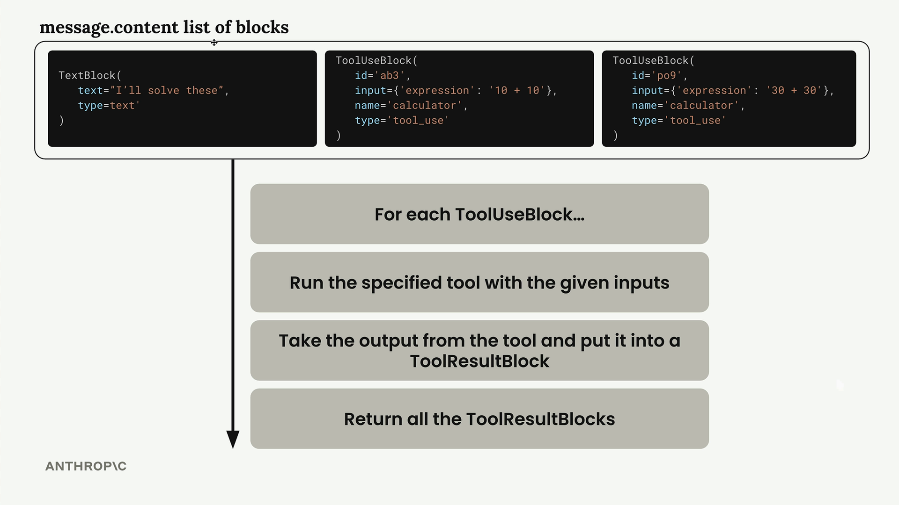
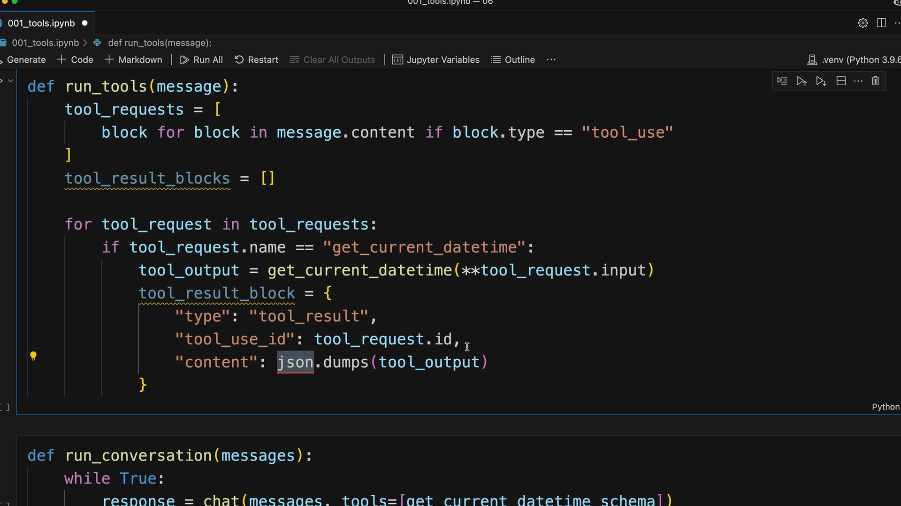

# SS08 · Implementing Multiple Turns

[:material-notebook-outline: Open Jupyter Notebook](../../notebooks/13.tools_multi-turn.ipynb){ .md-button .md-button--primary }

# Building a Conversation System with Tools

Building a conversation system with tools requires implementing a loop that keeps calling Claude until it stops requesting tool usage. When Claude no longer asks for tools, that signals it has a final response ready for the user.

## Detecting Tool Requests

The key to knowing whether Claude wants to use a tool lies in the `stop_reason` field of the response message. When Claude decides it needs to call a tool, this field gets set to `"tool_use"`.

This gives us a clean way to check if we need to continue the conversation loop:

```python
if response.stop_reason != "tool_use":
    break  # Claude is done, no more tools needed
```

## The Conversation Loop

The main conversation function follows a simple pattern:

```python
def run_conversation(messages):
    while True:
        response = chat(
            messages,
            tools=[get_current_datetime_schema]
        )

        add_assistant_message(messages, response)
        print(text_from_message(response))

        if response.stop_reason != "tool_use":
            break

        tool_results = run_tools(response)
        add_user_message(messages, tool_results)

    return messages
```

This loop continues until Claude provides a final answer without requesting any tools.

## Handling Multiple Tool Calls

Claude can request multiple tools in a single response. The message content contains a list of blocks, and each tool use block must be processed separately.



The `run_tools()` function handles this by filtering for tool use blocks and processing each one:

```python
def run_tools(message):
    tool_requests = [
        block
        for block in message.content
        if block.type == "tool_use"
    ]

    tool_result_blocks = []

    for tool_request in tool_requests:
        # Process each tool request...
```

## Tool Result Blocks

Each tool use block must be answered with a corresponding tool result block. The relationship between them is maintained through matching IDs.



A typical tool result block looks like this:

```python
tool_result_block = {
    "type": "tool_result",
    "tool_use_id": tool_request.id,
    "content": json.dumps(tool_output),
    "is_error": False
}
```

## Error Handling

Robust tool execution requires handling potential failures. Even when a tool errors out, a result block must still be returned to Claude.

```python
try:
    tool_output = run_tool(
        tool_request.name,
        tool_request.input
    )

    tool_result_block = {
        "type": "tool_result",
        "tool_use_id": tool_request.id,
        "content": json.dumps(tool_output),
        "is_error": False
    }

except Exception as e:
    tool_result_block = {
        "type": "tool_result",
        "tool_use_id": tool_request.id,
        "content": f"Error: {e}",
        "is_error": True
    }
```

This allows Claude to understand that the tool execution failed and potentially recover or provide an alternative response.

## Scalable Tool Routing

To support multiple tools, create a routing function that maps tool names to their implementations.

```python
def run_tool(tool_name, tool_input):
    if tool_name == "get_current_datetime":
        return get_current_datetime(**tool_input)

    elif tool_name == "another_tool":
        return another_tool(**tool_input)

    # Add more tools as needed
```

This approach makes it easy to add new tools without modifying the core conversation logic.

## Complete Workflow

A complete multi-turn tool workflow follows these steps:

1. Send the user's message to Claude along with the list of available tools.
2. Claude responds with text and/or tool requests.
3. Detect whether `stop_reason` is `"tool_use"`.
4. Execute all requested tools.
5. Create tool result blocks for each tool call.
6. Send tool results back as a user message.
7. Claude processes the tool outputs.
8. Repeat until `stop_reason` is no longer `"tool_use"`.

## End-to-End Flow Diagram

```text
User Message
      │
      ▼
   Claude
      │
      ▼
stop_reason == "tool_use" ?
      │
   ┌──┴──┐
   │ Yes │
   └──┬──┘
      ▼
 Execute Tools
      │
      ▼
Create Tool Results
      │
      ▼
Send Results to Claude
      │
      ▼
   Claude
      │
      └───────────────┐
                      │
                      ▼
          stop_reason != "tool_use"
                      │
                      ▼
              Final Response
```

## Key Takeaways

- Use the `stop_reason` field to determine whether Claude wants to call a tool.
- Continue the conversation loop while `stop_reason == "tool_use"`.
- Process every tool request found in the message content.
- Return a matching `tool_result` block for every `tool_use` block.
- Handle tool failures gracefully using error result blocks.
- Implement a centralized tool router to keep the system scalable.
- Maintain full conversation history so Claude can build on previous tool results.

This architecture enables Claude to use one or more tools across multiple conversation turns, gather external information, and ultimately produce a complete, context-aware response for the user.