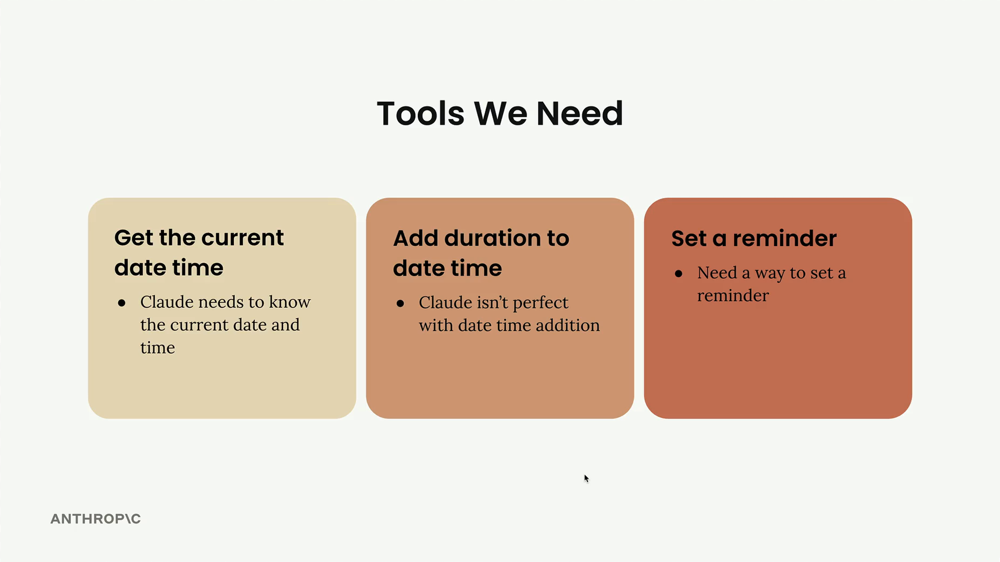
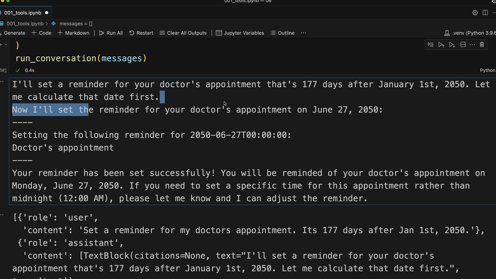

# SS09 · Using Multiple Tools

[:material-notebook-outline: Open Jupyter Notebook](../../notebooks/13.tools_multi-turn.ipynb){ .md-button .md-button--primary }

# Adding Multiple Tools to Your Claude Implementation

Adding multiple tools to your Claude implementation becomes straightforward once you have the core tool-handling infrastructure in place. This tutorial shows how to integrate additional tools by following a simple pattern.



## The Tools We're Adding

We need three main capabilities for our reminder system:

1. **Get current date time**  
   Claude needs to know the current date and time.

2. **Add duration to date time**  
   Claude is not always reliable at performing date-time arithmetic, so a dedicated tool helps ensure accuracy.

3. **Set a reminder**  
   A tool is needed to create and store reminders.

The good news is that most of the implementation work is already done. The `add_duration_to_datetime()` function and `set_reminder()` function are provided, along with their corresponding schemas.

---

## Adding Tools to the Conversation

First, update the `run_conversation()` function to include the new tool schemas in the tools list:

```python
response = chat(
    messages,
    tools=[
        get_current_datetime_schema,
        add_duration_to_datetime_schema,
        set_reminder_schema
    ]
)
```

This tells Claude about all three available tools it can use during the conversation.

---

## Updating the Tool Router

Next, modify the `run_tool()` function to handle the new tool calls.

Add additional cases for each tool:

```python
def run_tool(tool_name, tool_input):
    if tool_name == "get_current_datetime":
        return get_current_datetime(**tool_input)

    elif tool_name == "add_duration_to_datetime":
        return add_duration_to_datetime(**tool_input)

    elif tool_name == "set_reminder":
        return set_reminder(**tool_input)
```

The pattern is simple:

- Check the tool name.
- Call the corresponding implementation.
- Pass the tool input as arguments.
- Return the result.

---

## Testing Multiple Tool Usage

To test the system, try a request that requires more than one tool:

> Set a reminder for my doctor's appointment. It's 177 days after Jan 1st, 2050.

This request forces Claude to:

1. Calculate the target date using `add_duration_to_datetime`.
2. Create the reminder using `set_reminder`.



### Expected Tool Flow

```text
User Request
      │
      ▼
Calculate Date
(add_duration_to_datetime)
      │
      ▼
June 27, 2050
      │
      ▼
Set Reminder
(set_reminder)
      │
      ▼
Confirmation
```

Claude can describe its reasoning and then execute the required tool calls in sequence.

---


## Understanding the Message Flow

When examining the conversation history, you'll see a sequence of messages that capture the complete interaction between the user, Claude, and the tools.

### Message Sequence

1. User sends a request.
2. Claude responds with text and/or tool requests.
3. Tool results are returned.
4. Claude continues processing the results.
5. Claude provides the final answer.

### Example Structure

```text
User
 └─ "Set a reminder for my doctor's appointment..."

Assistant
 ├─ Text block
 └─ Tool use block (add_duration_to_datetime)

Tool Result
 └─ June 27, 2050

Assistant
 └─ Tool use block (set_reminder)

Tool Result
 └─ Reminder created successfully

Assistant
 └─ Final response to user
```

Claude can combine multiple content blocks within a single message, including:

- Explanatory text
- Tool requests
- Follow-up reasoning

---

## Complete Example

### Register Available Tools

```python
tools = [
    get_current_datetime_schema,
    add_duration_to_datetime_schema,
    set_reminder_schema,
]
```

### Conversation Loop

```python
def run_conversation(messages):
    while True:
        response = chat(messages, tools=tools)

        add_assistant_message(messages, response)

        if response.stop_reason != "tool_use":
            break

        tool_results = run_tools(response)
        add_user_message(messages, tool_results)

    return messages
```

### Tool Router

```python
def run_tool(tool_name, tool_input):
    if tool_name == "get_current_datetime":
        return get_current_datetime(**tool_input)

    elif tool_name == "add_duration_to_datetime":
        return add_duration_to_datetime(**tool_input)

    elif tool_name == "set_reminder":
        return set_reminder(**tool_input)

    else:
        raise ValueError(f"Unknown tool: {tool_name}")
```

---

## Adding New Tools

Once the tool infrastructure is in place, adding a new tool is straightforward:

1. Implement the tool function.
2. Define the tool schema.
3. Register the schema in the `tools` list.
4. Add the tool to the `run_tool()` router.

### Workflow

```text
New Tool
   │
   ├── Create Function
   ├── Create Schema
   ├── Register Schema
   └── Add Router Entry
            │
            ▼
       Ready to Use
```

## Key Takeaways

- Multiple tools can be provided to Claude through the `tools` list.
- Every tool requires a schema and an implementation.
- The `run_tool()` function maps tool names to their implementations.
- Claude can chain multiple tool calls to complete a single task.
- Tool requests and results become part of the conversation history.
- New tools can be added 