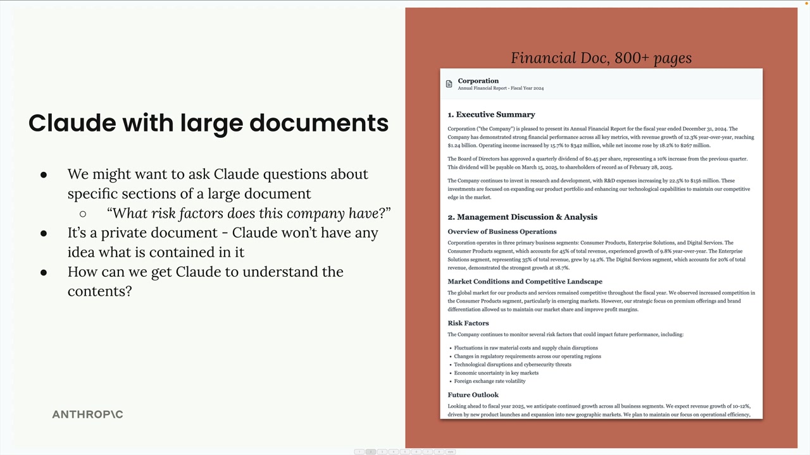
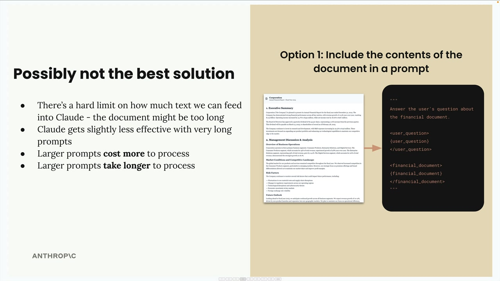
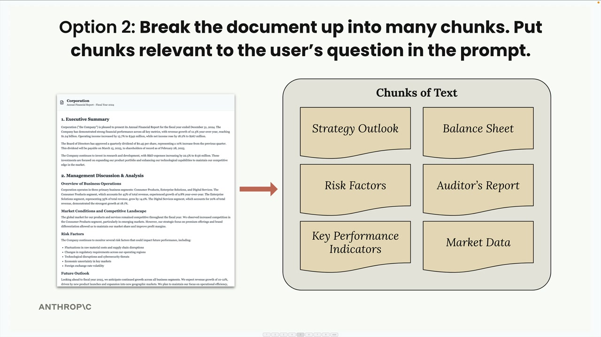
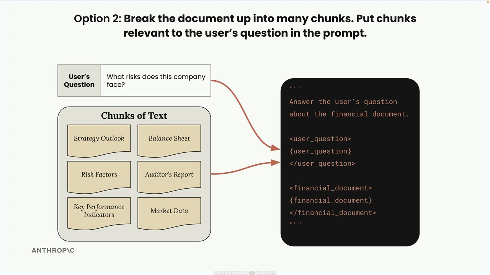

# SS01 · Introducing Retrieval Augmented Generation

# Retrieval Augmented Generation (RAG)

Retrieval Augmented Generation (RAG) is a technique that helps you work with large documents that are too big to fit into a single prompt. Instead of cramming everything into one massive prompt, RAG breaks documents into chunks and only includes the most relevant pieces when answering questions.

## The Problem with Large Documents

Imagine you have an 800-page financial document and want to ask Claude specific questions about it, such as:

> What risk factors does this company have?

You need to get the relevant information from the document to Claude somehow, but there are limits to how much text you can include in a prompt.



## Option 1: Include Everything in the Prompt

The first approach is straightforward: extract all text from the document and include it in your prompt along with the user's question.

Your prompt might look like this:

```text
Answer the user's question about the financial document.

<user_question>
{user_question}
</user_question>

<financial_document>
{financial_document}
</financial_document>
```




### Limitations

1. There's a hard limit on prompt length, so your document might be too long.
2. Claude becomes less effective with very long prompts.
3. Larger prompts cost more to process.
4. Larger prompts take longer to process.

## Option 2: Break Documents into Chunks

RAG takes a smarter approach.

First, you break the document into smaller chunks during a preprocessing step. Then, when a user asks a question, you find the chunks most relevant to their question and only include those in your prompt.



For example, if someone asks:

> What risks does this company face?

You would search through your chunks, find the **Risk Factors** section, and include only that relevant chunk in your prompt.



## Benefits of RAG

1. Claude can focus on only the most relevant content.
2. Scales up to very large documents.
3. Works with multiple documents.
4. Smaller prompts cost less and run faster.

## Challenges with RAG

1. Requires a preprocessing step to chunk documents.
2. Needs a search mechanism to find relevant chunks.
3. Included chunks might not contain all the context Claude needs.
4. There are many ways to chunk text, making it difficult to determine the best approach.

For example, you could:

- Split documents into equal-sized chunks.
- Create chunks based on document structure, such as headings and sections.

Each approach has trade-offs that should be evaluated for your specific use case.

## When to Use RAG

RAG involves many technical decisions and requires more work than simply including everything in a prompt. You'll need to analyze whether the benefits outweigh the complexity for your particular application.

RAG is especially valuable when:

- Working with very large documents.
- Working with multiple documents.
- Optimizing for cost and performance.

## Key Insight

RAG trades simplicity for scalability and efficiency.

While it requires more upfront work to implement properly, it enables you to work with document collections that would be impossible to handle using simple prompt stuffing.