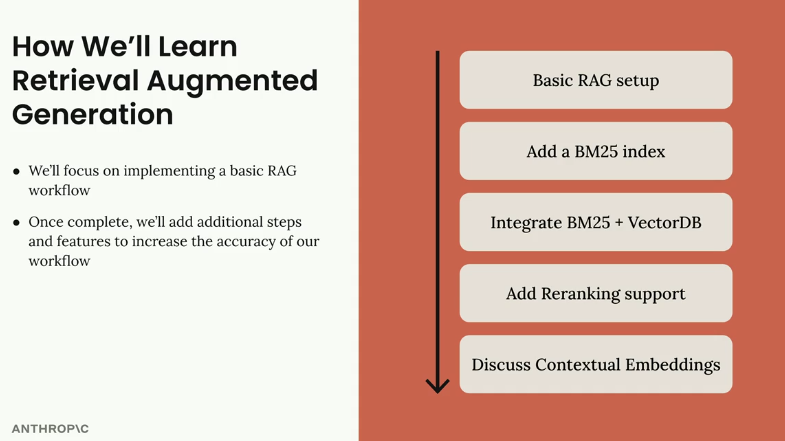
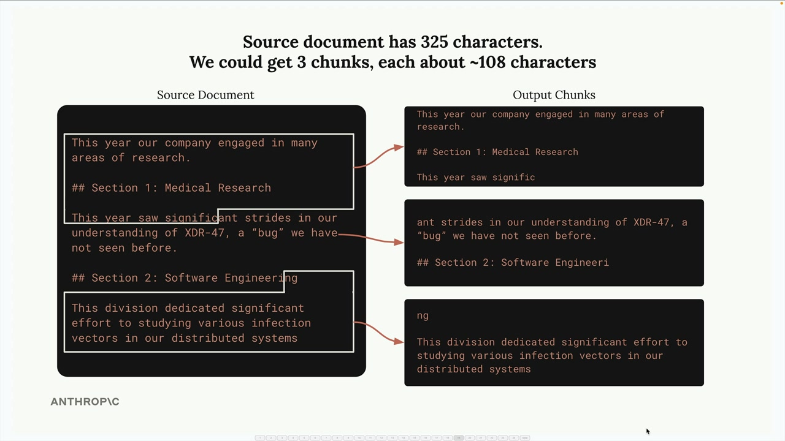
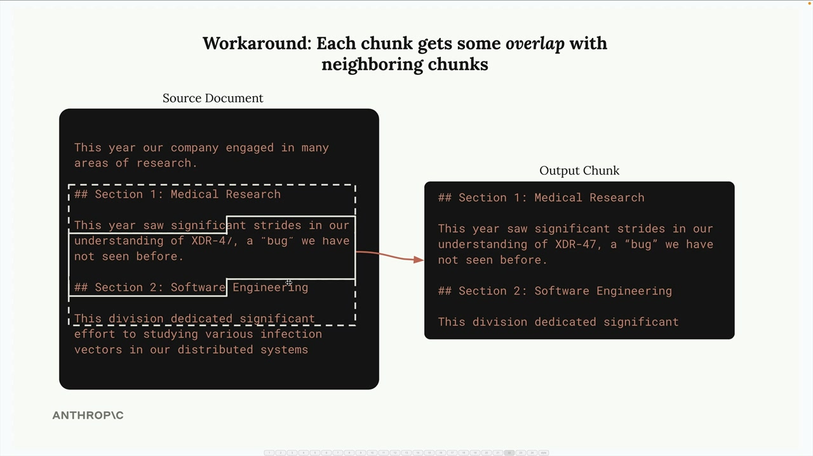

# SS02 · Text Chunking Strategies

[:material-notebook-outline: Open Jupyter Notebook](../../notebooks/17.chunking.ipynb){ .md-button .md-button--primary }

# Text Chunking Strategies for RAG



Text chunking is one of the most critical steps in building a RAG (Retrieval Augmented Generation) pipeline. How you break up your documents directly impacts the quality of your entire system. A poor chunking strategy can lead to irrelevant context being inserted into your prompts, causing your AI to give completely wrong answers.


Consider this example: you have a document with sections on medical research and software engineering. If you chunk poorly, a user asking:

> How many bugs did engineers fix this year?

might get information about medical research instead of software engineering, simply because the medical section happened to contain the word *bug* in a different context.


This is why choosing the right chunking strategy matters so much. Let's explore three main approaches.

## Size-Based Chunking


Size-based chunking is the simplest approach. You divide your text into strings of equal length. If you have a 325-character document, you might split it into three chunks of roughly 108 characters each.



This method is easy to implement and works with any type of document, but it has clear downsides:

1. Words get cut off mid-sentence.
2. Chunks lose important context from surrounding text.
3. Section headers might be separated from their content.


To address these issues, you can add overlap between chunks. This means each chunk includes some characters from neighboring chunks, providing better context and ensuring complete words and sentences.



### Example Implementation

```python
def chunk_by_char(text, chunk_size=150, chunk_overlap=20):
    chunks = []
    start_idx = 0

    while start_idx < len(text):
        end_idx = min(start_idx + chunk_size, len(text))
        chunk_text = text[start_idx:end_idx]
        chunks.append(chunk_text)

        start_idx = (
            end_idx - chunk_overlap
            if end_idx < len(text)
            else len(text)
        )

    return chunks
```

## Structure-Based Chunking

Structure-based chunking divides text based on the document's natural structure, such as headers, paragraphs, and sections. This works particularly well when you have well-formatted documents like Markdown files.


For a Markdown document, you can split on header markers:

### Example Implementation

```python
import re

def chunk_by_section(document_text):
    pattern = r"\n## "
    return re.split(pattern, document_text)
```

This approach gives you the cleanest and most meaningful chunks because each one represents a complete section.

However, it only works when you have guarantees about document structure. Many real-world documents are plain text or PDFs without clear structural markers.

## Semantic-Based Chunking

Semantic-based chunking is the most sophisticated approach.

You divide text into sentences and then use natural language processing (NLP) techniques to determine how related consecutive sentences are. Chunks are built from groups of semantically related sentences.

### Advantages

- Produces highly relevant chunks.
- Preserves contextual meaning.
- Often improves retrieval quality.

### Disadvantages

- Computationally expensive.
- More complex to implement.
- Requires semantic analysis models or embeddings.

While this method generally produces the best chunk quality, the additional cost and complexity may not always be justified.

## Sentence-Based Chunking

A practical middle ground is chunking by sentences.

You split the text into individual sentences and group them into chunks, optionally adding overlap between chunks to preserve context.

### Example Implementation

```python
import re

def chunk_by_sentence(
    text,
    max_sentences_per_chunk=5,
    overlap_sentences=1
):
    sentences = re.split(r"(?<=[.!?])\s+", text)

    chunks = []
    start_idx = 0

    while start_idx < len(sentences):
        end_idx = min(
            start_idx + max_sentences_per_chunk,
            len(sentences)
        )

        current_chunk = sentences[start_idx:end_idx]
        chunks.append(" ".join(current_chunk))

        start_idx += (
            max_sentences_per_chunk - overlap_sentences
        )

        if start_idx < 0:
            start_idx = 0

    return chunks
```

## Choosing Your Strategy

Your choice depends entirely on your use case and document guarantees.

### Structure-Based

**Best when you control document formatting.**

Examples:

- Internal company reports
- Markdown documentation
- Technical specifications

**Pros:**

- Highly meaningful chunks
- Preserves document hierarchy
- Excellent retrieval quality

**Cons:**

- Requires consistent structure
- Doesn't work well for unstructured content

### Sentence-Based

**Best as a general-purpose approach for text-heavy documents.**

**Pros:**

- Maintains sentence integrity
- Easy to implement
- Good balance of quality and complexity

**Cons:**

- May still split related concepts across chunks
- Doesn't understand semantic relationships

### Size-Based

**Best as a universal fallback.**

Examples:

- Raw text
- Code repositories
- Mixed-content datasets

**Pros:**

- Simple and reliable
- Works for any document type
- Easy to tune with overlap

**Cons:**

- Lowest chunk quality
- May break context and meaning

## Production Recommendations

Size-based chunking with overlap is often the go-to choice in production because it is:

- Simple
- Reliable
- Fast
- Compatible with any document type

While it may not produce perfect chunks, it consistently generates reasonable results without introducing significant complexity into your pipeline.

## Key Takeaway

There is no single "best" chunking strategy.

The right approach depends on:

- Your document formats
- Retrieval requirements
- Performance constraints
- Implementation complexity tolerance

In general:

| Strategy | Quality | Complexity | Best Use Case |
|----------|----------|------------|---------------|
| Structure-Based | High | Low-Medium | Well-formatted documents |
| Sentence-Based | Medium-High | Medium | General text documents |
| Semantic-Based | Highest | High | Advanced retrieval systems |
| Size-Based | Medium | Low | Universal fallback |

Remember: chunking is a foundational component of RAG. The effectiveness of your retrieval system often depends more on chunk quality than on the sophistication of the LLM itself.