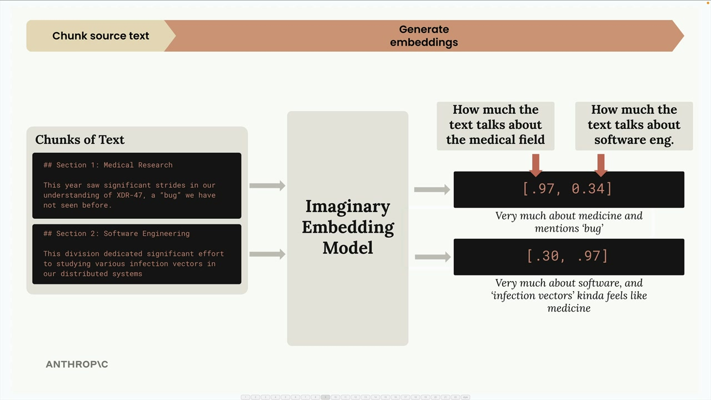
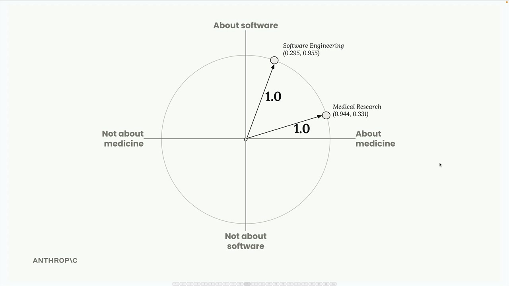
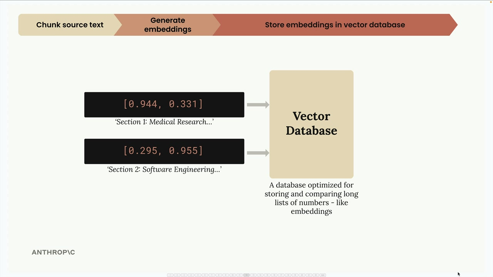
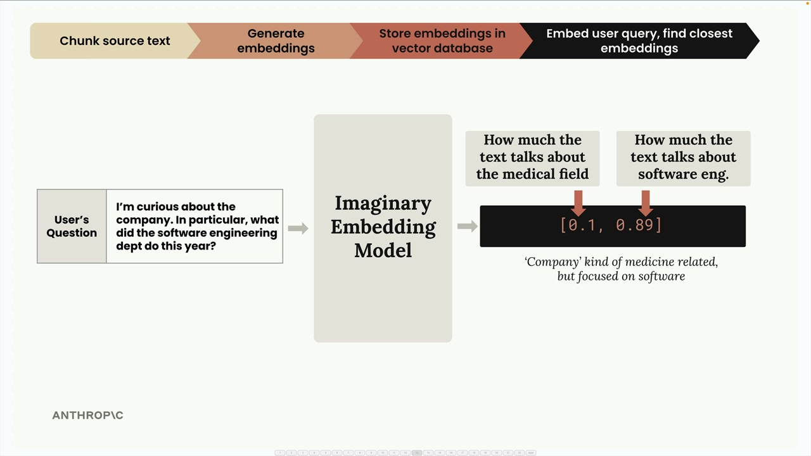
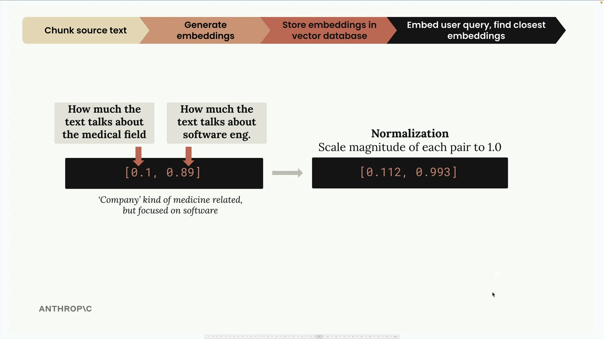
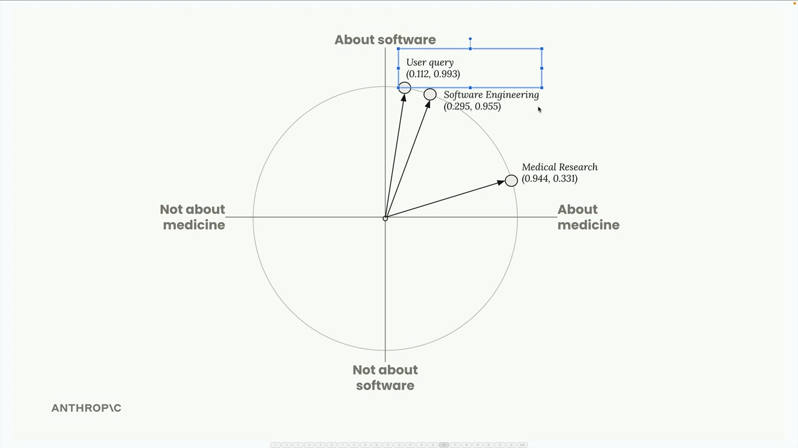
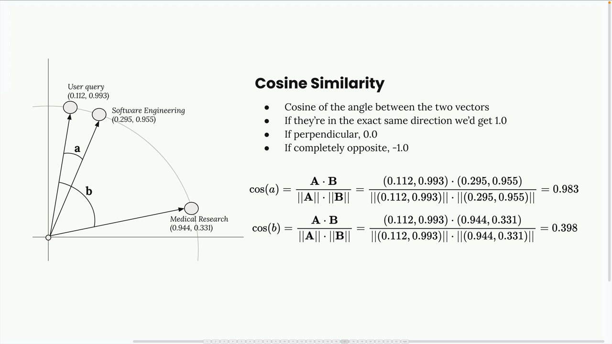
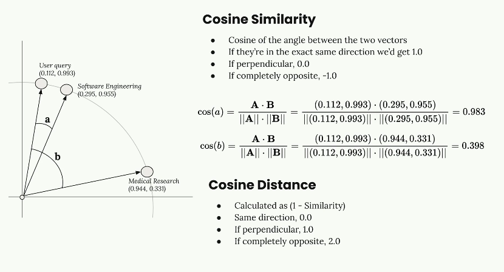
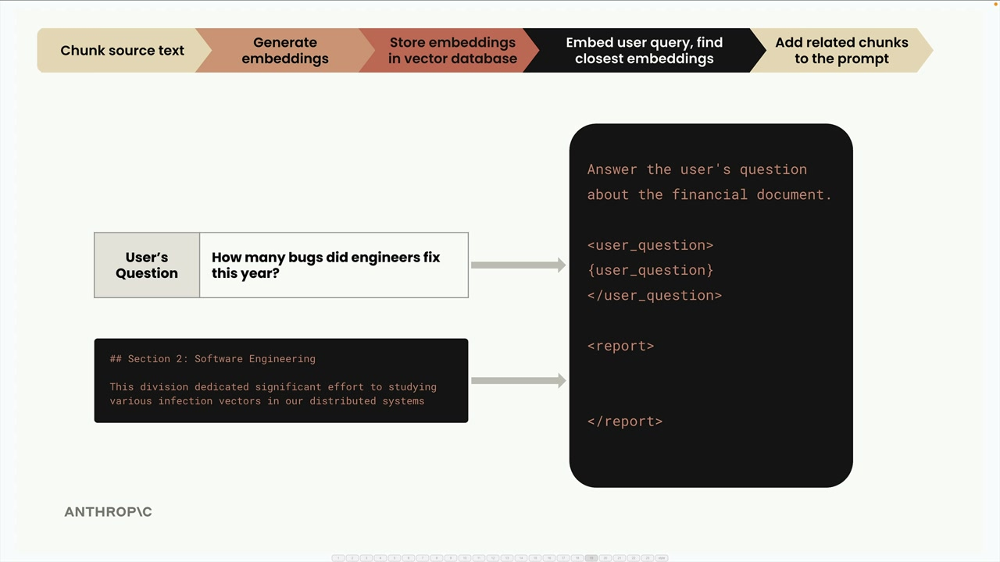

# SS04 · The Full RAG Flow

# Complete RAG Pipeline Walkthrough

Now that we've covered the basics of RAG, text chunking, and embeddings, let's walk through the complete RAG pipeline step by step. This example shows exactly how all these pieces work together to retrieve relevant information and generate responses.

## Step 1: Chunk Your Source Text

First, we take our source document and break it into manageable chunks.

For this example, we'll use two simple text sections:

1. **Section 1: Medical Research**  
   `"This year saw significant strides in our understanding of XDR-47, a 'bug' we have not seen before."`

2. **Section 2: Software Engineering**  
   `"This division dedicated significant effort to studying various infection vectors in our distributed systems"`

---

## Step 2: Generate Embeddings

Next, we convert each text chunk into numerical embeddings using an embedding model.

To make this easier to understand, let's imagine we have a perfect embedding model that always returns exactly two numbers, and we know what each number represents.



In our imaginary model:

1. The first number represents how much the text talks about the **medical field**.
2. The second number represents how much the text talks about **software engineering**.

For the medical research section, we might get:

```text
[0.97, 0.34]
```

This is very medical-focused but contains some software-related meaning because of the word *"bug"*.

For the software engineering section, we might get:

```text
[0.30, 0.97]
```

This is heavily software-focused but contains some medical-related meaning because of the phrase *"infection vectors"*.

### Normalization

The embedding API typically performs a normalization step that scales each vector to have a magnitude of `1.0`.

You don't need to worry about the math because it is handled automatically.

This gives us normalized vectors such as:

```text
[0.944, 0.331]
```

and

```text
[0.295, 0.955]
```



You can visualize these embeddings on a unit circle, where each point represents one of our text chunks.



---

## Step 3: Store in a Vector Database

We store these embeddings in a vector database, which is a specialized database optimized for storing, comparing, and searching through high-dimensional vectors like text embeddings.



At this point, we pause.

Everything we've done so far is preprocessing that happens ahead of time.

Now we wait for a user to submit a query.

---

## Step 4: Process the User Query

When a user asks a question such as:

> "I'm curious about the company. In particular, what did the software engineering dept do this year?"

we run that query through the same embedding model.



The query might be embedded as:

```text
[0.1, 0.89]
```

This indicates:

- Low medical relevance
- High software engineering relevance

After normalization, we get:

```text
[0.112, 0.993]
```

---

## Step 5: Find Similar Embeddings

We send the user's query embedding to our vector database and ask it to find the most similar stored embeddings.



The vector database returns the **Software Engineering** section because it is the closest match to the user's question.

### How Similarity Works: Cosine Similarity

Most vector databases use **cosine similarity** to determine how similar two embeddings are.




Cosine similarity measures the cosine of the angle between two vectors.

Key points:

1. Results range from `-1` to `1`.
2. Values close to `1` indicate high similarity.
3. Values close to `-1` indicate strong dissimilarity.
4. A value of `0` means the vectors are perpendicular and unrelated.

In our example:

```text
Similarity(query, software_chunk) = 0.983
Similarity(query, medical_chunk)  = 0.398
```

Since `0.983` is much higher than `0.398`, the software engineering chunk is selected.

### Cosine Distance

You'll often see the term **cosine distance** in vector database documentation.

Cosine distance is calculated as:

```text
1 - cosine similarity
```

With cosine distance:

1. Values close to `0` indicate high similarity.
2. Larger values indicate lower similarity.

Many systems use cosine distance because distance-based measurements are intuitive and work well with search algorithms.

---

## Step 6: Create the Final Prompt

Finally, we combine:

- The user's question
- The most relevant retrieved chunk

and send them to the LLM.

The prompt might look like this:

```text
Answer the user's question about the financial document.

<user_question>
How many bugs did engineers fix this year?
</user_question>

<report>
## Section 2: Software Engineering

This division dedicated significant effort to studying various infection vectors in our distributed systems
</report>
```

The language model now has access to the most relevant context and can generate a more accurate response.



---

## Summary of the RAG Pipeline

The complete RAG workflow looks like this:

```text
Source Documents
       │
       ▼
   Chunk Text
       │
       ▼
Generate Embeddings
       │
       ▼
Store in Vector Database
       │
       ▼
User Query
       │
       ▼
Generate Query Embedding
       │
       ▼
Similarity Search
       │
       ▼
Retrieve Relevant Chunks
       │
       ▼
Build Prompt
       │
       ▼
LLM Response
```

And that's the complete RAG pipeline. The system successfully retrieves the most relevant information using semantic similarity and provides that context to the language model, enabling more accurate and grounded responses.