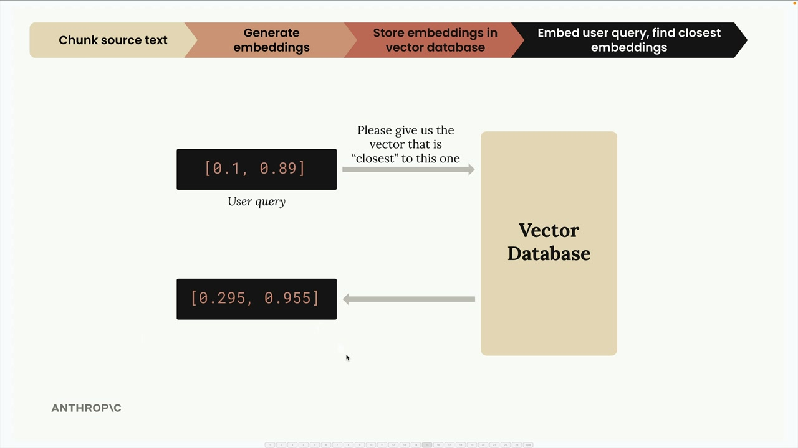
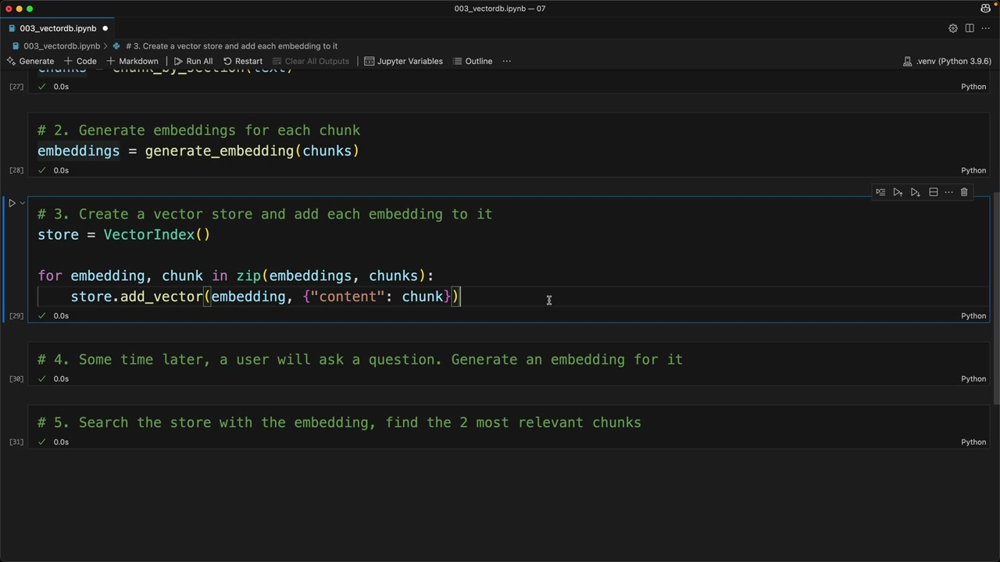

# SS05 · Implementing the RAG Flow

[:material-notebook-outline: Open Jupyter Notebook](../../notebooks/19.vectordb.ipynb){ .md-button .md-button--primary }

# Implementing a Complete RAG Pipeline

Now that we understand the RAG flow conceptually, let's implement it step by step. We'll walk through a complete example that demonstrates how to chunk text, generate embeddings, store them in a vector database, and perform similarity searches.

## The Five-Step RAG Implementation

Our implementation follows the same five-step process we discussed previously:

1. Chunk the text by section.
2. Generate embeddings for each chunk.
3. Create a vector store and add each embedding to it.
4. Generate an embedding for the user's question.
5. Search the store to find the most relevant chunks.



This workflow transforms both documents and user queries into embeddings, allowing us to perform semantic similarity searches against a vector database.

---

## Step 1: Chunking the Text

First, we load our document and split it into manageable sections:

```python
with open("./report.md", "r") as f:
    text = f.read()

chunks = chunk_by_section(text)

chunks[2]  # Test to see the table of contents
```

We use the same `chunk_by_section` function from earlier to split our document into logical sections.

---

## Step 2: Generate Embeddings

Next, we create embeddings for all our chunks at once:

```python
embeddings = generate_embedding(chunks)
```

The embedding function has been updated to handle both individual strings and lists of strings, making batch processing more efficient.

---

## Step 3: Store in a Vector Database

Now we create our vector store and populate it with embeddings and their associated text:

```python
store = VectorIndex()

for embedding, chunk in zip(embeddings, chunks):
    store.add_vector(embedding, {"content": chunk})
```

Notice that we store both the embedding and the original text content.

This is important because when we perform a search later, we need to retrieve the actual text associated with a matching embedding rather than the numerical vector itself.

### Why Store the Original Text?

When we query a vector database, the embedding alone is not useful to the user.

Even if the database identifies the closest vector, we ultimately need access to the source content used to generate that vector. Therefore, each embedding is stored alongside:

- The original text chunk
- Or a reference to where that text is stored

This allows the retrieval step to return meaningful content.

---

## Step 4: Process User Queries

When a user asks a question, we generate an embedding for that query:

```python
user_embedding = generate_embedding(
    "What did the software engineering dept do last year?"
)
```

The query is converted into the same embedding space used by the document chunks.

This ensures that document and query embeddings can be compared directly.

---

## Step 5: Find Relevant Content

Finally, we search the vector store for the most similar chunks:

```python
results = store.search(user_embedding, 2)

for doc, distance in results:
    print(distance, "\n", doc["content"][0:200], "\n")
```

This search returns the two most relevant chunks along with their similarity scores (reported here as cosine distances).



---

## Understanding the Results

When we run our example query about the software engineering department, we get results such as:

1. **Section 2: Software Engineering** with a distance of **0.71** (closest match)
2. **Methodology** section with a distance of **0.72** (second closest match)

Because lower cosine distance values indicate higher similarity, **Section 2: Software Engineering** is considered the most relevant result.

---

## What Happens Behind the Scenes?

The vector database performs several operations:

1. Receives the query embedding.
2. Compares it to all stored embeddings.
3. Computes similarity or distance scores.
4. Ranks the results.
5. Returns the most relevant chunks.

This entire process typically happens in milliseconds, even across thousands or millions of stored documents.

---

## Putting It All Together

The complete implementation flow looks like this:

```text
Document
   │
   ▼
Chunk Text
   │
   ▼
Generate Embeddings
   │
   ▼
Store in Vector Database
   │
   ▼
──────────────────────────
User Question
   │
   ▼
Generate Query Embedding
   │
   ▼
Vector Similarity Search
   │
   ▼
Retrieve Top Chunks
   │
   ▼
Build LLM Prompt
   │
   ▼
Generate Final Answer
```

---

## What's Next?

This implementation works well for basic semantic retrieval, but there are situations where simple embedding search isn't enough.

Common improvements include:

- Better chunking strategies
- Metadata filtering
- Hybrid search (keyword + semantic)
- Query rewriting
- Reranking retrieved chunks
- Context compression

These enhancements help improve retrieval accuracy and make RAG systems more robust in real-world applications.

## Key Takeaway

At its core, RAG is a simple but powerful idea:

1. Convert documents into embeddings.
2. Store those embeddings in a vector database.
3. Convert user questions into embeddings.
4. Use similarity search to find relevant content.
5. Provide that content to the LLM as context for answer generation.

Everything else in a RAG system is ultimately an optimization of one of these five steps.