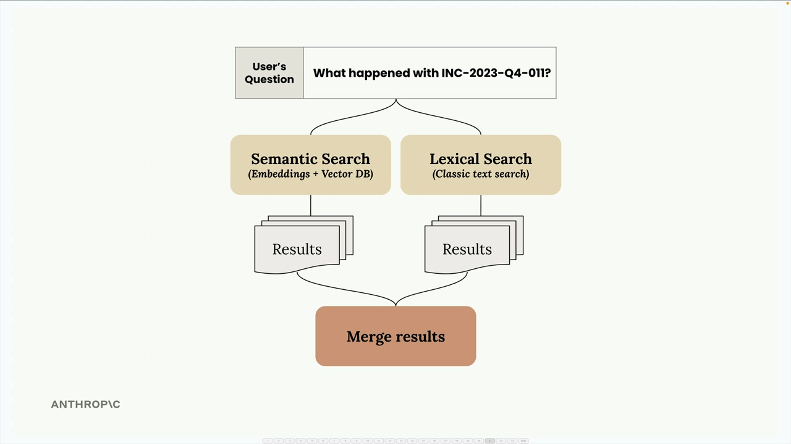
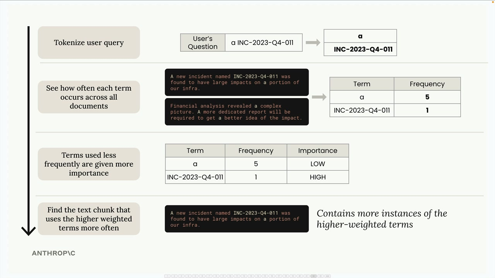
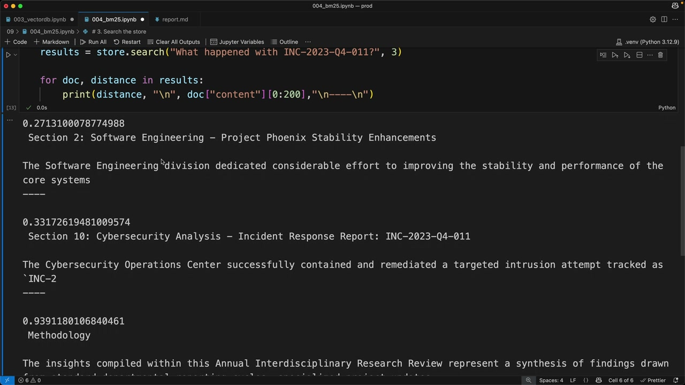

# SS06 · BM25 Lexical Search

[:material-notebook-outline: Open Jupyter Notebook](../../notebooks/20.bm25.ipynb){ .md-button .md-button--primary }

# Improving RAG with Hybrid Search and BM25

When building RAG pipelines, you'll quickly discover that semantic search alone doesn't always return the best results. Sometimes you need exact term matches that semantic search might miss.

The solution is to combine semantic search with lexical search using a technique called **BM25**.

---

## The Problem with Semantic Search Alone

Imagine you're searching for a specific incident ID:

```text
INC-2023-Q4-011
```

While semantic search is excellent at understanding context and meaning, it may return sections that are conceptually related without actually containing the exact term you're looking for.


For example:

- A cybersecurity section may contain the exact incident ID.
- A financial analysis section may discuss related topics and appear semantically similar.
- Semantic search may return both, even though only one contains the precise identifier.

This happens because semantic search prioritizes conceptual similarity rather than exact text matches.

---

## Hybrid Search Strategy

A common solution is **hybrid search**, where semantic and lexical searches run in parallel and their results are combined.



This provides the strengths of both approaches:

1. **Semantic Search**
   - Uses embeddings.
   - Finds conceptually related content.
   - Understands meaning and context.

2. **Lexical Search**
   - Uses traditional keyword matching.
   - Finds exact terms and phrases.
   - Excels at identifiers and technical terminology.

3. **Merged Results**
   - Combine semantic and lexical relevance.
   - Improve retrieval accuracy.
   - Reduce false positives.

---

## How BM25 Works

**BM25 (Best Match 25)** is one of the most widely used algorithms for lexical search.

Instead of understanding meaning, it measures how well documents match specific search terms.



### Step 1: Tokenize the Query

Break the query into individual terms.

Example:

```text
"a INC-2023-Q4-011"
```

becomes:

```python
["a", "INC-2023-Q4-011"]
```

---

### Step 2: Count Term Frequency

Determine how often each term appears across all documents.

Example:

```text
"a"                 → appears 5,000 times
"INC-2023-Q4-011"  → appears once
```

---

### Step 3: Weight Terms by Importance

Rare terms receive higher importance scores.

For example:

- `"a"` receives a very low weight because it appears everywhere.
- `"INC-2023-Q4-011"` receives a very high weight because it is rare and highly specific.

This concept is closely related to **Inverse Document Frequency (IDF)**.

---

### Step 4: Find the Best Matches

BM25 ranks documents according to:

- Presence of query terms
- Frequency of important terms
- Relative document length

Documents containing more high-value terms receive higher rankings.

---

## Implementing BM25 Search

Here's a simple implementation:

```python
# 1. Chunk your text by sections
chunks = chunk_by_section(text)

# 2. Create a BM25 index
store = BM25Index()

for chunk in chunks:
    store.add_document({
        "content": chunk
    })

# 3. Search the store
results = store.search(
    "What happened with INC-2023-Q4-011?",
    3
)

# Print results
for doc, distance in results:
    print(
        distance,
        "\n",
        doc["content"][:200],
        "\n----\n"
    )
```

This search returns the three most relevant documents based on BM25 scoring.



---

## Why BM25 Performs Better for Exact Searches

For searches involving identifiers like:

```text
INC-2023-Q4-011
Server-DB-07
Customer-88391
ErrorCode-E512
```

BM25 often outperforms semantic search because it focuses on exact token matches.

Instead of retrieving conceptually similar content, it retrieves documents containing the actual terms being searched.

---

## Example Outcome

Suppose your documents contain:

### Section 2: Software Engineering

```text
Incident INC-2023-Q4-011 caused elevated latency
in production systems.
```

### Cybersecurity Section

```text
The investigation into INC-2023-Q4-011 identified
several attack vectors.
```

A BM25 search for:

```text
INC-2023-Q4-011
```

would correctly prioritize:

1. Software Engineering
2. Cybersecurity

because both sections contain the exact incident ID.

A purely semantic search might additionally return unrelated sections that discuss incidents or investigations without mentioning the identifier.

---

## Why BM25 Is Valuable in RAG

BM25 excels because it:

1. Gives higher weight to rare, specific terms.
2. Ignores common words with little search value.
3. Focuses on exact matches.
4. Works especially well for:
   - Incident IDs
   - Product names
   - Error codes
   - Ticket numbers
   - Technical terms
   - File names
   - Version numbers

---

## Semantic Search vs. BM25

| Feature | Semantic Search | BM25 |
|----------|----------|----------|
| Understands meaning | ✅ | ❌ |
| Handles synonyms | ✅ | ❌ |
| Finds exact IDs | ⚠️ | ✅ |
| Requires embeddings | ✅ | ❌ |
| Works with keywords | ⚠️ | ✅ |
| Good for conceptual questions | ✅ | ⚠️ |
| Good for technical lookups | ⚠️ | ✅ |

Neither approach is universally better.

They solve different retrieval problems.

---

## The Hybrid Search Approach

Modern RAG systems typically use:

```text
User Query
     │
     ├──► Semantic Search
     │        │
     │        ▼
     │   Embedding Results
     │
     └──► BM25 Search
              │
              ▼
         Lexical Results
              │
              ▼
        Merge Rankings
              │
              ▼
      Retrieve Final Chunks
              │
              ▼
            LLM
```

This architecture allows the system to retrieve:

- Conceptually relevant information via embeddings.
- Exact matches via BM25.

By combining both retrieval methods, hybrid search produces more accurate and reliable results than either approach alone.

---

## Key Takeaway

Semantic search and BM25 solve complementary problems:

- **Semantic search** answers: *"Which documents mean something similar?"*
- **BM25 search** answers: *"Which documents contain the exact terms I'm looking for?"*

The strongest RAG systems use both. Hybrid search ensures you benefit from semantic understanding while still capturing critical exact-match information such as incident IDs, error codes, and technical terminology.